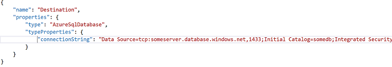
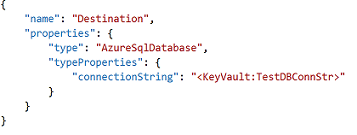
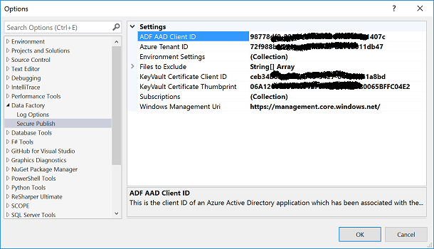
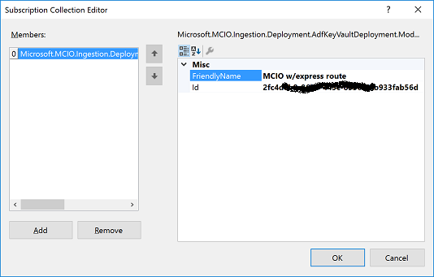

# Introduction
The Visual Studio Azure Data Factory project template is very useful for creating and maintaining ADF projects. The project template comes with a publish context menu item which allows you to publish the Data Factory directly to Azure.    
Inside linked Services and deployment configuration files we specify sensitive data such as connection strings to data bases and blob storage keys. In order to use the in built publish command these secrets must be in plain text.  
  
It is not advisable and often against security policy to commit this sensitive data to the code repository.  
ADF Secure Publish allows these secrets to be stored in Key Vault and only references to them are specified in the linked services/ deployment configs. These references are resolved in-momory during deployment time and the ADF project is published to Azure. These files can then be committed to source repository without exposing any secrets.  
  

ADF secure publish adds a new context item to the ADF project template allowing you to publish your ADF project without risk of exposing confidental data.  
  

# Getting Started
The ADF Secure publish Visual studio Extension can be installed from: VSExtension\SecurePublishMenuCommand.vsix

# Prerequisites
Cert based authentication is used to access Key Vault so a certificate will need to be previously associated with your target Key Vault and any user using ADF Secure Publish will need to have this cert installed on their local machine.
Instructions for associating a certificate with KeyVault can be found here: https://azure.microsoft.com/en-us/documentation/articles/key-vault-use-from-web-application/.
The thumbprint of the certificate also needs to be configured in the user settings. Instructions on what user settings need to be configured is described below.
  
Any subscription which you wish to deploy a Data Factory must be associated with an AAD client ID. This client ID will be configured with the Secure Publish user settings. Instructions on how to create a new AAD client ID and associate target subscriptions are described next.  

# How to create a new AAD client ID to associate with a subscription
1.  Open up PowerShell
2.  Log in to Azure by typing in the cmd: 
    Login-AzureRmAccount
3.  Change to the subscription you wish to use by typing the cmd: 
	Select-AzureRmSubscription -SubscriptionId "&lt;enter subscription ID here&gt;"
4.  Create a new AD application by entering the cmd: 
    $azureAdApplication = New-AzureRmADApplication -DisplayName "&lt;Enter a name for your AD App here&gt;" -HomePage "&lt;Enter a URL here, it can be anything&gt;" -IdentifierUris "&lt;Enter a unique URL here, it can be anything&gt;" -Password "&lt;create a password and enter it here&gt;"
    Note: The password must be placed in each KeyVault which you are using and assign the identifier SecurePublishAdfClientSecret to it.
    The corresponding Client ID needs to be assigned to the KeyVaultCertClientId user setting variable (retrieved in step 7). See section; Configuring Secure Publish settings for information on user settings.
5.  Create an AD service principal for this application:
    New-AzureRmADServicePrincipal -ApplicationId $azureAdApplication.ApplicationId
6.  Add the service principal to the Data Factory Contributor role.
    New-AzureRmRoleAssignment -RoleDefinitionName "Data Factory Contributor" -ServicePrincipalName $azureAdApplication.ApplicationId.Guid
7.  Note the client ID by running the following cmd and selecting the value of ApplicationId:
    $azureAdApplication.ApplicationId.Guid
8.  Add the secret corresponding to the KeyVaultCertClientId variable (generated above in step 4) to the KeyVault and assign the identifier SecurePublishAdfClientSecret to it.

# Configuring Secure Publish user settings
The settings required for Secure Publish can be configured by going to

Tools -> Options -> Data Factory -> Secure Publish  
  

Here is a description of each setting:
*   ADF AAD Client ID - This is the client ID of an Azure Active Directory application which has been associated with the subscription which has data factories that we want to publish to.
*   Azure Tenant ID - This is the azure tenant ID associated with your account.
*   Environment Settings - The environment settings, consisting of; Environment Name, associated Key Vault, and associated deployment config (if one exists)
*   Files to Exclude - The name of files which will be excluded from the deployment to Azure.
*   KeyVault Certificate Client ID - This is the client ID of an Azure Active Directory application which has the certificate associated with it.
*   KeyVault Certificate Thumbprint - This is the thumbprint of a certificate which has been registered with all Key Vaults which Secure Publish accesses. It also needs to be installed on the local machine in order to access these Key Vaults.
*   Subscriptions - The subscriptions which target Data Factories reside. Enter a friendly name and ID for each target subscription.

Most of these settings will only need to be set once, however if you wish to add a new subscription or a new environment then you will need to update these settings.

# How to add a new Subscription
Go to   
Tools -> Options -> Data Factory -> Secure Publish -> Click the ellipsis for Subscriptions  
Click add to add a new subscription  
  

In the FriendlyName field, enter a name that you will use to select your subscription in the Subscription dropdown.  
And enter the subscription ID in the Id field. Next time you launch secure publish you will see your subscription in the Subscription dropdown.  

# How to add a new environment
Each environment is tied to a Key Vault and optionally a deployment configuration file. You can configure a new environment by going to:  
Tools -> Options -> Data Factory -> Secure Publish -> Click the ellipsis for Environment Settings  
Click add to add a new environment:  
  

In the Name field, add a name you will use to identify the environment.  
In the KeyVaultName field, add the name of the Key Vault you wish to associate with the environment.  
If you wish to associate a deployment config then enter the name of the file in the DeploymentConfig field. If you do not have a deployment config, you can leave this field blank.

# How to reference Key Vault secrets in your ADF project
Once the Key Vault that you wish to target has been associated with an environment, you will add your secrets and reference them in your ADF files.  
You can add and view secrets directly through the Azure Key Vault UI: https://ms.portal.azure.com/#blade/HubsExtension/Resources/resourceType/Microsoft.KeyVault%2Fvaults  
Once your secrets are added, you reference them in your ADF files by using the following token:  
"<KeyVault:identifier>" where the identifier corresponds to the name of your Key Vault secret.  
These tokens can be placed anywhere in your pipelines, tables, linked services or deployment configs and they will be resolved at deployment time.  

# How to do a Secure Publish
Right click on the ADF project in Solution Explorer to open the project context menu and click on the first menu item called Secrue Publish. This will open the following form:  
  

Select the subscription which your data factory resides in. Next select the environment you want to deploy to and the data factory. Hit publish to trigger the deployment and keep an eye on the output window to see the status of the deployment.  
The deployment process performs the following tasks in sequence:  
Builds the ADF project.  
Validates all ADF json files and selects the deployment config if it exists.   
Identifies any custom activity packages and uploads them to Azure.  
Deploys Linked Services to the selected data factory, followed by tables and pipelines.  

The output window updates in real time, so when the deployment is complete, you will be notified.  
  

