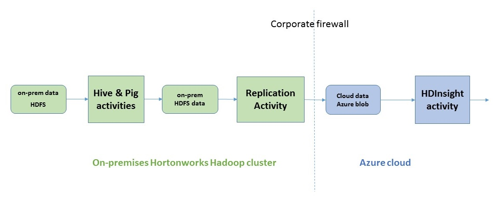
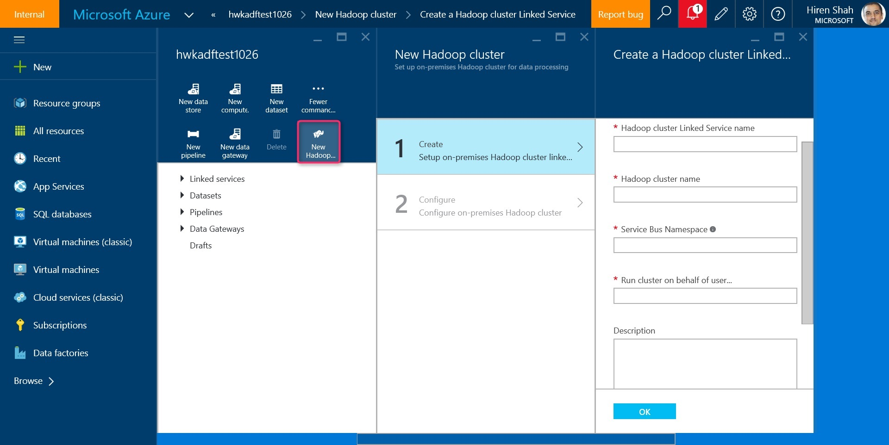
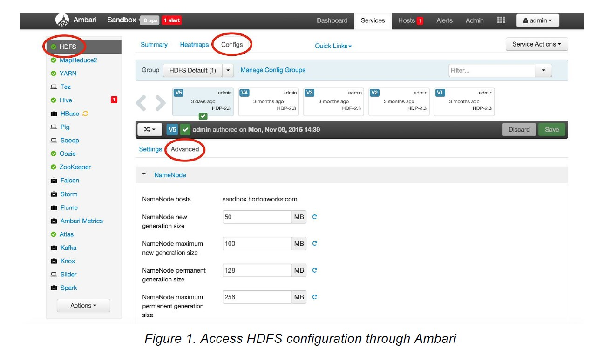
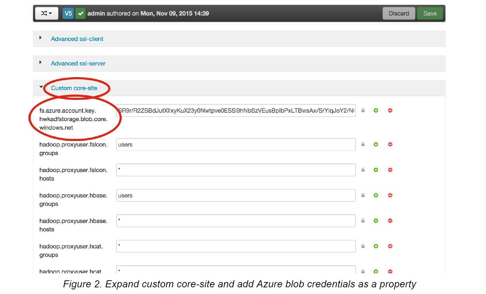

# On-premise and cloud hybrid Hadoop data pipelines with Hortonworks and Cortana Analytics #

[Azure Data Factory](https://azure.microsoft.com/en-us/services/data-factory/) and [Hortonworks Falcon team](http://hortonworks.com/hadoop/falcon/) jointly announced the availability of private preview for building hybrid Hadoop data pipelines leveraging on-premises Hortonworks Hadoop clusters and cloud based Cortana Analytics services like HDInsight Hadoop clusters and Azure Machine Learning.

Customers maintaining on-premises Hadoop based data lakes need to often times enable hybrid data flows extending on-premises data lake into the cloud for various reasons:

1. Keep **PII and other sensitive data** on-premises for privacy, compliance reasons but leverage cloud for elastic scale for workloads that don’t need the sensitive information.
2. Leverage cloud for **cross region replication, disaster recovery at scale**.
3. Leverage cloud for **dev, test environments**.

Hybrid Hadoop pipeline preview enables these scenarios by allowing you to now add your on-premises Hadoop cluster as a compute target for running jobs in Data Factory just like you would add other compute targets like an HDInsight based Hadoop cluster in cloud. 

You can enable connectivity between your on-premises cluster with data factory service over a secure channel with just a few clicks. Once you do that as shown above you can develop a hybrid pipeline that does the following:

1.	Run Hadoop Hive & Pig jobs on-premises with the **new on-premises Hadoop Hive, Pig activities** in data factory.
2.	Copy data from on-premises HDFS to Azure blob in cloud with the **new on-premises replication activity**.
3.	Add more steps to the pipeline and continue big data processing in cloud with Hadoop HDInsight activity for example.

The private preview is available for a small set of select customers. If you are interested in becoming a private preview customer please take this [brief survey](http://www.instant.ly/s/5se7W/nav#p/186a0) and we will let you know if your use case is a good fit for the private preview. 
 
# Step by Step instructions for enabling hybrid pipelines #

**Step 1 Upgrade your on-premise Hortonworks distribution Falcon binaries to the tech preview version by following the Falcon upgrade instructions [here](./DocumentationFiles/ADFTutorial.pdf)**.

**Step 2 Create a data factory and connect the cloud data factory to your on-premises Hadoop cluster**

1. Create a data factory using your Azure subscription.

2. Leverage the "New Hadoop cluster" option in data factory editor in Azure web portal as shown below. Enter the required information like name of the Hadoop cluster etc. and complete the wizard.

	
	
	The wizard will create 2 linked services in your data factory. The JSON for the linked services can be found in ./Data Factory JSONs/LinkedServices folder in the sample.
	
	a. TransportLinkedService
	
	This linked service contains information about a unique Azure service bus namespace that is used for communicating job requests and status information between data factory and your on-premises Hadoop cluster.
	
	b. OnPremisesHadoopCluster linked service
	
	This linked service references the above mentioned transport linked service and represents the on-premises Hadoop cluster as a data factory compute resource. You can use this resource as compute target for your data factory Hive and Pig jobs.

3. Configure on-premises Hadoop Falcon instance to connect using Azure service bus namespace transport.

	Falcon reads Azure Service Bus information from conf/startup.properties when it starts. Hence Azure service bus namespace and credential needs to be added before starting Falcon, and Falcon needs to be restarted if there is  any change in the credential. 
	
	Add the following section in your Falcon conf/startup.properties file with Azure namespace taken from Transport linked service and credentials for the Azure bus namespace taken from Azure web portal.

		######### ADF Configurations start #########    
		
		# A String object that represents the namespace
		
		*.microsoft.windowsazure.services.servicebus.namespace=<your azure service bus namespace>    
		
		# Request and status queues on the namespace
		
		*.microsoft.windowsazure.services.servicebus.requestqueuename=adfrequest  
		*.microsoft.windowsazure.services.servicebus.statusqueuename=adfstatus
		
		# A String object that contains the SAS key name  
		*.microsoft.windowsazure.services.servicebus.sasKeyName=RootManageSharedAccessKey
		
		# A String object that contains the SAS key  
		*.microsoft.windowsazure.services.servicebus.sasKey=<your Azure service bus SAS key>
		
		# A String object containing the base URI that is added to your Service Bus namespace to form  the URI to connect  
		# to the Service Bus service. To access the default public Azure service, pass  ".servicebus.windows.net"  
		*.microsoft.windowsazure.services.servicebus.serviceBusRootUri=.servicebus.windows.net
		
		# Service bus polling frequency (in seconds)  
		*.microsoft.windowsazure.services.servicebus.polling.frequency=60

4. Restart Falcon with start/stop commands as follows:

		Change to falcon user: su ­- falcon
		Go to Falcon directory on Sandbox: ​cd /usr/hdp/2.3*/falcon­/
		To start Falcon: ​bin/falcon­-start  
		To stop Falcon: ​bin/falcon-­stop  
		Note:Falcon logs are stored at ​logs/falcon.application.log

	At this point you have successfully connected Azure data factory and on-premises Falcon!

**Step 3. Run Hive, Pig jobs on-premises using data factory from cloud**

You can now create datasets and pipelines to run Hive and Pig jobs targeting the on-premises Hadoop cluster.

Here is sample dataset and pipeline for running a Hive script.  Similarly you can also run a Pig job on-premises. The sample JSONs for all the objects can be found in ./Data factory JSONs/ folder.

		{
	    "name": "OnpremisesInputHDFSForHadoopHive",
	    "properties": {
	        "published": false,
	        "type": "CustomDataset",
	        "linkedServiceName": "OnpremisesHadoopCluster",
	        "typeProperties": {
	            "tableName": "partitionedcdrs",
	            "partitionedBy": "yearno=${YEAR};monthno=${MONTH}"
	        },
	        "availability": {
	            "frequency": "Day",
	            "interval": 1
	        },
	        "external": true,
	        "policy": {
	            "executionPriorityOrder": "OldestFirst"
            }
	    }
	    }

		{
 		   "name": "OnpremisesOutputHDFSForHadoopHive",
 		   "properties": {
        	"published": false,
        	"type": "CustomDataset",
        	"linkedServiceName": "OnpremisesHadoopCluster",
        	"typeProperties": {
            	"tableName": "callsummarybymonth",
            	"partitionedBy": "yearno=${YEAR};monthno=${MONTH}"
        	},
        	"availability": {
            	"frequency": "Day",
            	"interval": 1
        	}
 	   	}
		}

		{
	    "name": "TestHiveRunningOnHDPHiveInHDFS",
	    "properties": {
	        "description": "Test pipeline to run Hive script on an-onpremises HDP cluster (Hive is in HDFS location)",
	        "activities": [
	            {
	                "type": "HadoopHive",
	                "typeProperties": {
	                    "runOnBehalf": "ambari-qa",
	                    "scriptPath": "/apps/falcon/adf-demo/demo.hql",
	                    "Year": "$$Text.Format('{0:yyyy}',SliceStart)",
	                    "Month": "$$Text.Format('{0:%M}',SliceStart)",
	                    "Day": "$$Text.Format('{0:%d}',SliceStart)"
	                },
	                "inputs": [
	                    {
	                        "name": "OnpremisesInputHDFSForHadoopHive"
	                    }
	                ],
	                "outputs": [
	                    {
	                        "name": "OnpremisesOutputHDFSForHadoopHive"
	                    }
	                ],
	                "policy": {
	                    "executionPriorityOrder": "OldestFirst",
	                    "timeout": "00:05:00",
	                    "concurrency": 1,
	                    "retry": 1
	                },
	                "scheduler": {
	                    "frequency": "Day",
	                    "interval": 1
	                },
	                "name": "HiveScriptOnHDPCluster",
	                "linkedServiceName": "OnpremisesHadoopCluster"
	            }
	        ],
	        "start": "2014-11-01T00:00:00Z",
	        "end": "2014-11-02T00:00:00Z",
	        "isPaused": false,
	        "hubName": "hwkadftest1026_hub",
	        "pipelineMode": "Scheduled"
	    }
	}

**Step 4. Run replication job to copy files from on-premises HDFS store to Azure blob**

1. Set up Azure Blob credentials

	To move data to and from Azure blobs with Falcon replication job, we need to add Azure blob credentials in HDFS. The best way is to add Azure blob credential property to coresite through Ambari.
	
	a. Log in to Ambari: http://[cluster ip]:8080. 
	
	b. Add Azure blob credential property to custom coresite.
	
	Go to advanced configs for HDFS, , expand custom coresite and click “add property” (see images below) and add Azure credential as key/value property. Use the following format for the key:
	
	fs.azure.account.key.AZURE_BLOB_ACCOUNT_NAME.blob.core.windows.net, 
	
	e.g.
	fs.azure.account.key.hwkadfstorage.blob.core.windows.net. 
	
	Use the Azure blob account key for the value.
	
	c. Restart the relevant components in the following order: HDFS, YARN, MapReduce2, Oozie, Falcon. The best way is to click on each component and use ‘restart all’ action on Ambari. Use the instructions above on how to restart Falcon. 
	
	d. Test if we can access Azure blobs through HDFS:
	
	e.g. hdfs dfs ls wasb://<containername>@hwkadfstorage.blob.core.windows.net/

	

	

2. You can now setup the on-premises input dataset, output dataset in Azure blob and a pipeline to copy the data with the replication activity. The sample JSONs are shown below.
 
		{
		    "name": "OnpremisesInputHDFSForHadoopMirror",
		    "properties": {
		        "published": false,
		        "type": "CustomDataset",
		        "linkedServiceName": "OnpremisesHadoopCluster",
		        "typeProperties": {
		            "folderPath": "/apps/hive/warehouse/callsummarybymonth/yearno=${YEAR}/monthno=${MONTH}"
		        },
		        "availability": {
		            "frequency": "Day",
		            "interval": 1
		        },
		        "external": true,
		        "policy": {
		            "executionPriorityOrder": "OldestFirst"
		        }
		    }
		}

		{
		    "name": "AzureBlobDatasetForHadoopMirror",
		    "properties": {
		        "published": false,
		        "type": "AzureBlob",
		        "linkedServiceName": "AzureBlobStorage",
		        "typeProperties": {
		            "folderPath": "results/${YEAR}/${MONTH}",
		            "format": {
		                "type": "TextFormat"
		            }
		        },
		        "availability": {
		            "frequency": "Day",
		            "interval": 1
		        }
		    }
		}

		{
		    "name": "TestReplicate2Azure",
		    "properties": {
		        "description": "Test pipeline to mirror data on onpremises HDFS to azure",
		        "activities": [
		            {
		                "type": "HadoopMirror",
		                "typeProperties": {},
		                "inputs": [
		                    {
		                        "name": "OnpremisesInputHDFSForHadoopMirror"
		                    }
		                ],
		                "outputs": [
		                    {
		                        "name": "AzureBlobDatasetForHadoopMirror"
		                    }
		                ],
		                "policy": {
		                    "executionPriorityOrder": "OldestFirst",
							"timeout": "00:05:00",
		                    "concurrency": 1,
		                    "retry": 1
		                },
		                "scheduler": {
		                    "frequency": "Day",
		                    "interval": 1
		                },
		                "name": "MirrorData 2Azure",
		                "linkedServiceName": "OnpremisesHadoopCluster"
		            }
		        ],
		        "start": "2014-11-01T00:00:00Z",
		        "end": "2014-11-02T00:00:00Z",
		        "isPaused": false,
		        "hubName": "hwkadftest1026_hub",
		        "pipelineMode": "Scheduled"
		    }
		}