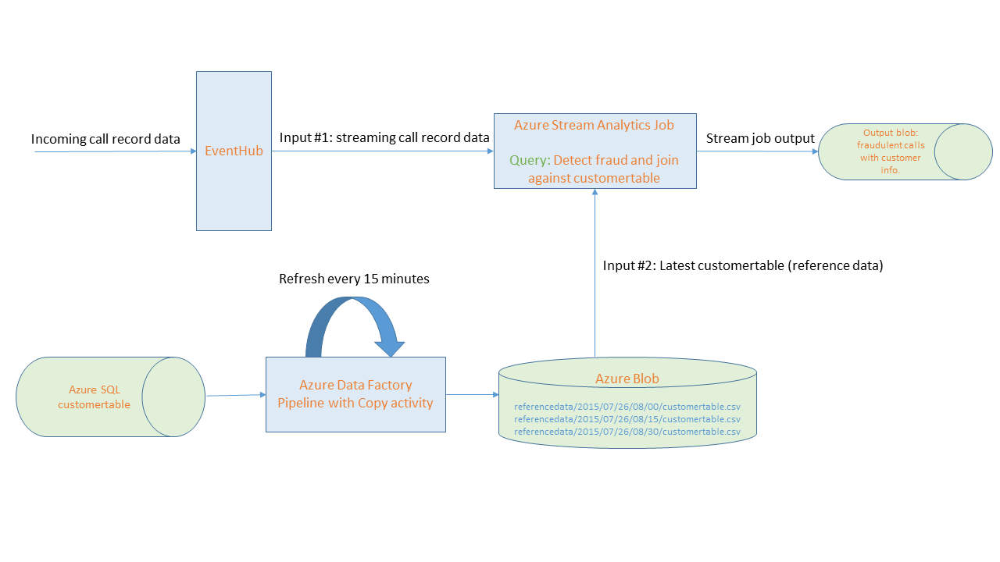
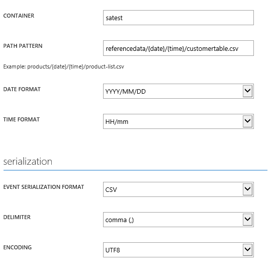

# Refreshing reference data with Azure Data Factory for Azure Stream Analytics Jobs #

Often times for your queries as part of your [stream analytics](https://azure.microsoft.com/en-us/documentation/services/stream-analytics/) jobs you want to join the incoming event stream like device, sensor measurements with slow changing [“reference data”](https://azure.microsoft.com/en-us/documentation/articles/stream-analytics-connect-data-event-inputs/#reference-data-inputs) like device profile or  customer profile information. This enables you to create enhanced reports on insights generated by the stream job. This can for example allow you to slice anomalies detected by your stream jobs by the customers it is impacting. 

## Working with reference data with Stream Analytics ##

Stream analytics supports taking reference data stored in Azure blob storage as one of the [“inputs”](https://azure.microsoft.com/en-us/documentation/articles/stream-analytics-connect-data-event-inputs/) for the job. To enable support for refreshing reference data the user needs to specify a list of blobs in the input configuration using the {date} and {time} tokens inside the path pattern. The job will load the corresponding blob based on the date and time encoded in the blob names using UTC time zone.

For example if the job has a reference input configured in the portal with the path pattern such as: /referencedata/{date}/{time}/customertable.csv where the date format is “YYYY/MM/DD” and the time format is “HH/mm” then the job will pick up a file named /referencedata/2015/07/26/08/30/customertable.csv at 8:30 AM on July 26th 2015 UTC time zone.

This requires the customers to address the following 2 challenges:

1. If your reference data is in a data store other than Azure blob you need to figure out how to move it to Azure blob.
1. While reference data changes relatively infrequently it still does change and you want to have a regular refresh schedule so that the reference data is picked up  and dropped in azure blob with the right path with datatime information as shown above.

## Refreshing reference data from a variety of data stores with Azure Data Factory ##

[Azure data factory](http://azure.microsoft.com/en-us/documentation/services/data-factory/) is the perfect solution for the above mentioned challenges. Data Factory is a cloud-based data integration service that orchestrates and automates the movement and transformation of data. Data factory supports [connecting to a large number of cloud based and on-premises data stores](https://azure.microsoft.com/en-us/documentation/articles/data-factory-data-movement-activities/) and moving data easily on a regular schedule your specify. 

Let’s take a concrete example. [Steam analytics get started guide](https://azure.microsoft.com/en-us/documentation/articles/stream-analytics-get-started/) shows a scenario for a telecommunication company where call records data is processed in a streaming fashion at scale and analyzed for SIM card fraud - multiple calls coming from the same identity around the same time but in geographically different locations. The stream analytics job for this scenario takes one input which is the streaming call records data coming in through eventhub. Now suppose we wanted to add another input – reference data with information about the customers (customerInfo table) like their name, contact information. This allows us to add a join against the customertInfo table in the streaming query that detects fraudulent calls to identify which customers are being affected by the fraud. Also suppose the customerInfo table is maintained in an Azure SQL database and can be updated multiple times during the day as new customers are added, contact information is changed etc. 

The diagram below shows the high level solution architecture leveraging data factory and stream analytics together to run the above mentioned query with reference data and setup the refresh for reference data on a schedule. 

As shown above you can create a data factory pipeline with copy activity which copies latest version of customertable from Azure SQL to blob in the corresponding path based on date & time information. The Azure stream analytics jobs is configured to take customertable as reference data input and always picks up the latest copy of the reference data as it becomes available. 

To learn more about the details of the solution follow the step by step walk through of setting up the sample.

## Step by Step Walk Through ##

### Setting up the ASA job for Telecommunication SIM Fraud Detection ###

1. First follow the step by step guide to setup the [ASA job for detecting telecommunication SIM fraud](https://azure.microsoft.com/en-us/documentation/articles/stream-analytics-get-started/). If you already have a stream analytics job setup you can skip setting up this step but read through to understand how the next piece - using data factory to refresh reference data fits with your ASA job.

	The above guide will walk you through the following setup.

	a. Creating an eventhub.

	b. Using the [TelcoGenerator app ](https://github.com/Azure/azure-stream-analytics/tree/master/DataGenerators/TelcoGenerator.)to generate events to send to EventHub.

	c. Setup the ASA job with the right inputs and the query for fraud detection.

	The query for fraud detection from the article above is:

		SELECT System.Timestamp as Time, CS1.CallingIMSI, CS1.CallingNum as CallingNum1,
		CS2.CallingNum as CallingNum2, CS1.SwitchNum as Switch1, CS2.SwitchNum as Switch2
		FROM CallStream CS1 TIMESTAMP BY CallRecTime
		JOIN CallStream CS2 TIMESTAMP BY CallRecTime
		ON CS1.CallingIMSI = CS2.CallingIMSI
		AND DATEDIFF(ss, CS1, CS2) BETWEEN 1 AND 5
		WHERE CS1.SwitchNum != CS2.SwitchNum

	Once you get the ASA job setup, running and producing output with the above query you would want to stop the job and modify it according to the steps below before starting it again.
    
2. Next we will modify the TelcoGenerator to reduce the no. of possible IMSI values to a smaller list. Note: This step is optional but it will help us make sure we only have to create a customertable with a small no. of contacts.

 	In CDRecord.cs file of TelcoGenerator App comment out the big IMSI numbers list and replace it with a smaller list   as follows:

            //static string[] IMSIList = { "466923300507919","466921602131264","466923200348594","466922002560205","466922201102759","466922702346260","466920400352400","466922202546859","466923000886460","466921302209862","466923101048691","466921200135361","466922202613463","466921402416657","466921402237651","466922202679249","466923300236137","466921602343040","466920403025604","262021390056324","466920401237309","466922000696024","466923100098619","466922702341485","466922200432822","466923000464324","466923200779222","466923100807296","466923200408045" };
        static string[] IMSIList = { "466923100098619", "466922002560205", "466922201102759", "466923200348594", "466923300507919"};

	You can restart the TelcoGenerator app after the above change. Also chose a high probablity of .9 for fraud so we can easily see lots of output fraudulent events.

 

1. Now we will modify the ASA job to add customertable reference data as input and update the query above to join against that input.

	Select the inputs tab, add an input and select the type of input as reference data. Specify storage account information and setup reference data with the following container and path pattern as a csv file.

	

4. Next update the query for the job to add the step to join against the customertable data as follows:

		SELECT System.Timestamp as Time, CS1.CallingIMSI, CS1.CallingNum as CallingNum1,
		CS2.CallingNum as CallingNum2, CS1.SwitchNum as Switch1, CS2.SwitchNum as Switch2, CI.ID, CI.IMSI, CI.FirstName, CI.LastName
		FROM CallStream CS1 TIMESTAMP BY CallRecTime
		JOIN CallStream CS2 TIMESTAMP BY CallRecTime
		ON CS1.CallingIMSI = CS2.CallingIMSI
		AND DATEDIFF(ss, CS1, CS2) BETWEEN 1 AND 5
		JOIN customerdata CI
		ON CS1.CallingIMSI = CI.IMSI
		WHERE CS1.SwitchNum != CS2.SwitchNum

	We are pulling the first name and last name of the customer to whom the IMSI number involved in fraud belongs. 

 We are now all set with the ASA job. You can now start the job. Note: even though we have added the reference data input we have not done the data factory setup to pull this table from Azure SQL and drop it the above blob location. As a result the ASA job will start but initially will not find any reference data. As a result the job will not produce any output. Next we will setup the Azure data factory pipeline to drop the reference data which will cause the ASA job to start picking up the data and start generating the output of fraudulent calls with customer first name and last name.

## Setting up Azure data factory pipeline ##

The steps below assume basic familiarity with key data factory concepts like linked services, datasets, pipeline, activities etc. The steps also assume you know how to create and work with these JSON objects in the data factory editor on Azure portal.

If you are not familiar with data factory and data factory editor here are a couple of articles you can use to get up to speed first.

1. [Introduction to data factory.](https://azure.microsoft.com/en-us/documentation/articles/data-factory-introduction/)
2. [Build your first pipeline tutorial](https://azure.microsoft.com/en-us/documentation/articles/data-factory-build-your-first-pipeline/) (follow the Using data factory editor tab after you have read through the overview).

The JSON objects referred in the steps below can also be found in the repo under [Data Factory JSONs](https://github.com/hirenshahms/Azure-DataFactory/tree/master/Samples/ReferenceDataRefreshForASAJobs/Data%20Factory%20JSONs) folder.

Here is a quick summary of the setup. The steps below show how to setup a pipeline with a copy activity that runs every 15 minutes and copies the customertable from an Azure SQL database to Azure blob storage. The data for each 15 minute interval is stored in a unique path containing the date & time values for that specific interval as shown in the solution architecture diagram above.

###1. Create the data factory.###

Please refer to steps in the first pipeline tutorial on how to do this.

###2. Create linked service for Azure SQL###

Using data factory editor create the linked service for Azure SQL that provides data factory with the credential and catalog information to connect to the right Azure SQL database that contains your customer table. Fill in the required fields in the template below.

    {
    "name": "AzureSqlLinkedService",
    "properties": {
        "type": "AzureSqlDatabase",
        "typeProperties": {
            "connectionString": "Data Source=<data source>;Initial Catalog=<catalog name>;User ID=<user id>;Password=<password>"
        }
    }
	}

###3. Create linked service for Azure storage###

Using data factory editor create the linked service for your azure storage account. This provides data factory the account information to connect to the right blob storage account. This is the same blob storage account that the ASA job is using to read the reference data from. Fill in the required fields in the template below.

	{
    "name": "StorageLinkedService",
    "properties": {
        "type": "AzureStorage",
        "typeProperties": {
            "connectionString": "DefaultEndpointsProtocol=https;AccountName=<account name>;AccountKey=<key>"
        }
    }
	}

###4. Create the input dataset for Azure SQL table

Use the editor to create the input dataset for the Azure SQL table. Note the following:

a. The table name in the Azure SQL database in the sample below is "customerinfo". Change this if you want your table name to be different.

b. The input dataset references the linked service for Azure SQL we created earlier for connection information.

	{
    "name": "CustomerTableSQL",
    "properties": {
        "published": false,
        "type": "AzureSqlTable",
        "linkedServiceName": "AzureSqlLinkedService",
        "typeProperties": {
            "tableName": "customerinfo"
        },
        "availability": {
            "frequency": "Minute",
            "interval": 15,
            "style": "StartOfInterval"
        },
        "external": true,
        "policy": {
            "executionPriorityOrder": "OldestFirst",
        }
    }
	}

###5. Create the output dataset for Azure blob

Use the editor to create the output dataset for Azure blob. Note the following:

1. The filePath and folderPath are setup as follows. Be sure to create a container called "satest" in your blob storage account. The path is parameterized to include the specific 15 minute interval.

	"fileName": "customertable.csv",

	"folderPath": "satest/referencedata/{Year}/{Month}/{Day}/{Hour}/{Minute}",

		{
		"name": "CustomerTableBlob",
		"properties": {
		    "published": false,
		    "type": "AzureBlob",
		    "linkedServiceName": "StorageLinkedService",
		    "typeProperties": {
		        "fileName": "customertable.csv",
		        "folderPath": "satest/referencedata/{Year}/{Month}/{Day}/{Hour}/{Minute}",
		        "format": {
		            "type": "TextFormat",
		            "columnDelimiter": ","
		        },
		        "partitionedBy": [
		            {
		                "name": "Year",
		                "value": {
		                    "type": "DateTime",
		                    "date": "SliceEnd",
		                    "format": "yyyy"
		                }
		            },
		            {
		                "name": "Month",
		                "value": {
		                    "type": "DateTime",
		                    "date": "SliceEnd",
		                    "format": "MM"
		                }
		            },
		            {
		                "name": "Day",
		                "value": {
		                    "type": "DateTime",
		                    "date": "SliceEnd",
		                    "format": "dd"
		                }
		            },
		            {
		                "name": "Hour",
		                "value": {
		                    "type": "DateTime",
		                    "date": "SliceEnd",
		                    "format": "HH"
		                }
		            },
		            {
		                "name": "Minute",
		                "value": {
		                    "type": "DateTime",
		                    "date": "SliceEnd",
		                    "format": "mm"
		                }
		            }
		        ]
		    },
		    "availability": {
		        "frequency": "Minute",
		        "interval": 15,
		        "style": "StartOfInterval"
		    }
		}
		}

###5. Create the pipeline###

We bring it all together by creating a pipeline with a copy activity that takes the Azure SQL dataset we created as input and produces the blob dataset we setup above as output every 15 minutes.

Be sure to adjust the following JSON for the following before entering in data factory editor.

1. Give valid start and end datetime. This time is in ISO format with UTC time. Typically you want to give a start date as today's date and end date at least 1-2 days from today. Note: data factory is designed to automatically backfill the copy tasks for intervals in the past. So depending on the time of day you do this you will see copy tasks getting executed for all the hours since mid night for the given day right away. Once testing is done end date can be set to a future date like 9999-09-09 to make sure the pipeline executes continuously.

2. The "blobWriteAddHeader" : true setting tells data factory to add the schema information in the output csv file as the first row. The ASA job uses the schema information to identify the column names in the ASA query shown in the ASA job section.

		{
		"name": "SATestReferenceDataCopy",
		"properties": {
		    "description": "Copy reference data from a Azure SQL table to blob",
		    "activities": [
		        {
		            "type": "Copy",
		            "typeProperties": {
		                "source": {
		                    "type": "SqlSource"
		                },
		                "sink": {
		                    "type": "BlobSink",
		                    "blobWriterAddHeader": true,
		                    "writeBatchSize": 0,
		                    "writeBatchTimeout": "00:00:00"
		                }
		            },
		            "inputs": [
		                {
		                    "name": "CustomerTableSQL"
		                }
		            ],
		            "outputs": [
		                {
		                    "name": "CustomerTableBlob"
		                }
		            ],
		            "policy": {
		                "timeout": "01:00:00",
		                "concurrency": 1,
		                "executionPriorityOrder": "NewestFirst",
		                "style": "StartOfInterval"
		            },
		            "scheduler": {
		                "frequency": "Minute",
		                "interval": 15,
		                "style": "StartOfInterval"
		            },
		            "name": "CopyFromSQLToBlob",
		            "description": "Copy reference customer data from a Azure SQL table to blob"
		        }
		    ],
		    "start": "2015-07-23T17:00:00Z",
		    "end": "2015-07-27T00:00:00Z",
		    "isPaused": false
		}
		}

As soon as you deploy the pipeline you should see data factory create the corresponding copy tasks and begin copying reference data at every 15 minute interval and the ASA job picking up the latest copy of the reference data. Note: Once the data is copied to blob there is an additional 15 minute delay before which ASA job picks up the reference data. Hence the total delay for a change in the reference data table to take effect with the ASA job is 30 minutes.

