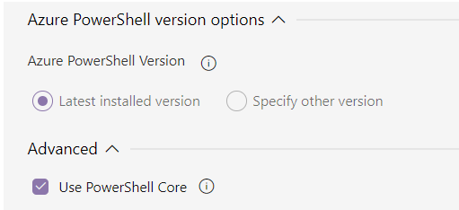

### Sample pre- and post-deployment script (PrePostDeploymentScript.Ver2.ps1)

This sample script can be used to stop triggers before deployment and restart them afterward. It stops the triggers only if they are changed and is in _started_ state which is an improvement to previous script (PrePostDeploymentScript.ps1) that stops all triggers before deployment. It will help reduce the deployment time and minimize the possibility of missing triggers during the deployment. The script also includes code to delete resources that have been removed

* When running a pre-deployment script, please specify a variation of the following parameters in the Script Arguments field.

```azurepowershell
-armTemplate "$(System.DefaultWorkingDirectory)/<your-arm-template-location>" -ResourceGroupName <your-resource-group-name> -DataFactoryName <your-data-factory-name> -predeployment $true -deleteDeployment $false -armTemplateParameters "$(System.DefaultWorkingDirectory)/<your-arm-template-parameters-location>" -explicitStopTriggerList "<triggerName1>", "<triggerName2>"
```

**Note:** The script is not very comprehensive in detecting the trigger changes. If the script failed to detect the trigger change, you can always use _explicitStopTriggerList_ parameter to pass the list of triggers to stop explicitly before deployment

* When running a post-deployment script, please specify a variation of the following parameters in the Script Arguments field.

```azurepowershell
-armTemplate "$(System.DefaultWorkingDirectory)/<your-arm-template-location>" -ResourceGroupName <your-resource-group-name> -DataFactoryName <your-data-factory-name> -predeployment $false -deleteDeployment $true
```
* Make sure to use **PowerShell Core** in ADO task to run the script


### Sample pre- and post-deployment script (PrePostDeploymentScript.ps1)

This sample script can be used to stop triggers before deployment and restart them afterward. The script also includes code to delete resources that have been removed

* When running a pre-deployment script, please specify a variation of the following parameters in the Script Arguments field.

```azurepowershell
-armTemplate "$(System.DefaultWorkingDirectory)/<your-arm-template-location>" -ResourceGroupName <your-resource-group-name> -DataFactoryName <your-data-factory-name> -predeployment $true -deleteDeployment $false
```

* When running a post-deployment script, please specify a variation of the following parameters in the Script Arguments field.

```azurepowershell
-armTemplate "$(System.DefaultWorkingDirectory)/<your-arm-template-location>" -ResourceGroupName <your-resource-group-name> -DataFactoryName <your-data-factory-name> -predeployment $false -deleteDeployment $true
```

### Sample script to deploy global parameters (GlobalParametersUpdateScript.ps1)

This script can be used to promote global parameters to additional environments
