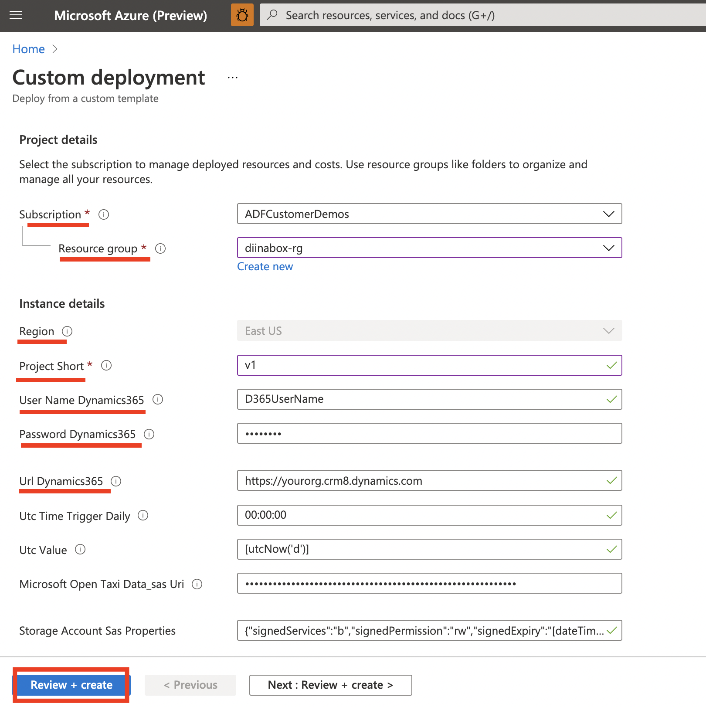
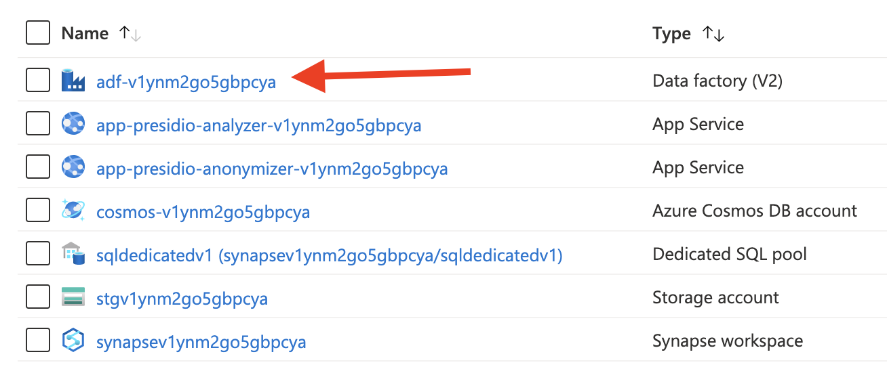

# Data Integration in a box

The data integration in a box empowers you to experience the best of data integration on Azure and how you can load the data into Azure Synapse Analytics.

***Monitor and analyze your Dynamics 365 sales leads and activities using Azure Data Factory and Azure Synapse analytics in just a few clicks.*** 

[](https://portal.azure.com/#create/Microsoft.Template/uri/https%3A%2F%2Fraw.githubusercontent.com%2FAzure%2FAzure-DataFactory%2Fmain%2FSamplesV2%2FDataIntegrationInABox%2Ftemplate.json)


## What's in the solution

**Azure Data Factory** is Azure's cloud ETL service for scale-out serverless data integration and data transformation. It offers a code-free UI for intuitive authoring and single-pane-of-glass monitoring and management. 

**Presidio** is data protection and ananomyzation SDK (an open source project) that allows organizations to preserve privacy in a simpler way by democratizing de-identification technologies and introducing transparency in decisions. It facilitate both fully automated and semi-automated PII de-identification flows across multiple platforms.

**Azure Synapse analytics** is a limitless analytics service that brings together data integration, enterprise data warehousing, and big data analytics. 

*This ‘Data integration in a box’ solution provides several essential tables for sales and user activities tracking from Dynamics 365 to gauge their sales pipeline health. It generates the respective tables, implies the schema, and creates separate tables with cleansed data in the data warehouse.*

The solution uses two differnt data sources: 

1. **Dynamics 365** (*activitypointer entity* [[schema](https://docs.microsoft.com/dynamics365/customer-engagement/web-api/activitypointer?view=dynamics-ce-odata-9)], *lead entity* [[schema](https://docs.microsoft.com/dynamics365/customer-engagement/web-api/lead?view=dynamics-ce-odata-9)])
2. **NYC Taxi data** from [Microsoft Open Datasets](https://docs.microsoft.com/azure/open-datasets/dataset-taxi-yellow?tabs=azureml-opendatasets)


The Data Integration in a box solution **extracts** sales lead and activity from Dynamics 365 into **Azure Synapse Analytics** and **Azure CosmosDB** using Azure Data Factory pipeline. It also *anonymizes/ masks sensitive data* using **Presidio APIs** as part of transformation task. It then uses visual **Azure Data Factory Data flows** to join the two entities and filters activities generated with leads from ones without leads for further analysis. Finally it writes the two streams into standardized **Common Data Model (CDM)** format into the data lake for further consumption.

The data integration in the box solution contains: 

- A pipeline that **extracts** parquet data from an <u>Azure Open Dataset</u> to <u>Synapse Analytics</u>. 
- Two pipelines that **extract** data from a <u>Dynamics 365</u> demo account to <u>Cosmos DB</u> and <u>Synapse Analytics</u>.
- Two pipelines that **anonymizes** the sensitive customer data (PII) before landing it in the data warehouse using [Presidio APIs](https://github.com/microsoft/presidio). 
- A mapping dataflow that **transforms** data from these two data sources and loads it to a <u>Common Data Model (CDM)</u> data structure,
- A pipeline that runs the mapping dataflow (**transform**)

For details refer [Data Integration Pipelines](Pipelines.md). 


## How does Azure Data Factory help 

1. Azure Data Factory provides **serverless, scalable** and **cost-effective** data integration using **98+ out of box connectors**. In this solution we everage the Dynamics 365, Azur Datalake Gen2, Azure CosmosDB and Azure Synapse Analytics connectors. 
2. It offers **visual ‘no code’ transformations** using **Data flows** and **Power Query** interface that can scale to big-data needs and manage the on-demand infrastructure. 
3. It standardizes the data into Common Data Model (CDM) format for downstream consumption. 
4. It **anonymizes** PII data from Dynamics 365 using **Microsoft’s Presidio** library. 
5. It helps you **automate** the data pipelines to incrementally extract and transform the Dynamics data with cadence ranging from '1' minutes. 

 

## Prerequisite

This demo has a few prerequesites that you will have to take care of.

### Pre-Deployment: Create Dynamics 365 account
You will need a (free demo) Dynamics 365 account and the credentials to that account. You can obtain an account on [https://trials.dynamics.com](https://trials.dynamics.com/).

For deploying this template you will need the **username** and **password** for a user registered with that demo account as well as the demo accounts URL which will typically be **https://\<your-demo-tenant-name\>.crm8.dynamics.com**.

### Deployment: Create resources using the ARM template 

Click on the 'Data Integration in the box' button on the top of this page to create all the required resources on your Azure subscription. Provide the below highligted fields. 

*Note: If you do not add Dynamics user credentials, the creation will still go through. The Dynapmics pipelines will not work and you will need to update the credentials later.* 



### Post-Deployment: grant acces to Synapse dedicated pool for Azure Data Factory

Furthermore you will need to grant your data factory permisssion to access your Synapse dedicated SQL pool. 

You can do this by running the following SQL after logging into your dedicated SQL pool via the Azure Synapse workspace:

```sql
create user [<your_ADF_name_here>] from external provider;
exec sp_addrolemember 'db_owner', '<your_ADF_name_here>';
```

To do so, execute the follwing steps: 

1. Navigate to your resource group in the Azure portal, then open your Synapse workspace 

    

2. On the overview page of your Synapse Workspace click the tile to open the synapse workspace 

    

3. In the left side menu chose "develop" to open the development blade: 

    

4. In the development blade, click the plus symbol and then click "SQL script" to start writing a new SQL script: 

    

5. At the top of the editor, use the "Connect to" dropdown to connect to your dedicated SQL pool 

    

6. Make sure you have also selected the dedicated pool database: 

    

7. Paste your code and click "Run" at the top of the editor window to execute it. After a few seconds you will see a green checkmark and a success message at the bottom of the window. 

    ```sql
    create user [<your_ADF_name_here>] from external provider;
    exec sp_addrolemember 'db_owner', '<your_ADF_name_here>';
    ```


### Post-Deployment: Enable your daily trigger (optional)

The Azure Data Factory created from the ARM template contains a daily trigger. This trigger is disabled by default. If you want your data pipeline to be executed on a daily basis, you will need to activate the trigger. 

To do so, navigate to your data factroy authoring site through the Azure portal. There, open the "Manage" blade in the left menu and in the second menu open the "Triggers" blade:

 

Locate the trigger and click it. On the right-hand side of the window, a menu will open, activate the trigger by selecting the appropriate radiobutton and click "OK".

 


## Running the data pipelines

Once you have completed the prerequisites, launch the data factory.



You can execute the **'00-ControlPipeline'** using  **'Trigger -> Trigger now'** button.  


To validate the output dataset in Synapse DW and Cosmos DB refer [Data Integration pipelines documentation](Pipelines.md).

## Contribute

You are encourged to contribute to the repository by adding more scenarios thereby enriching it. Feel free to send a Pull Request (PR) with the changes, and we will merge the PR after reviewing it.  