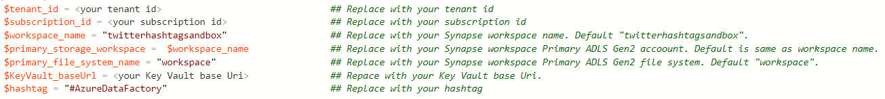
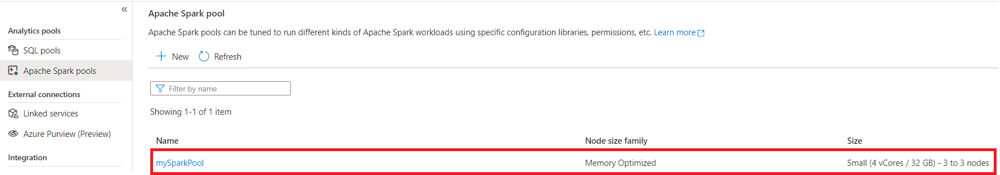
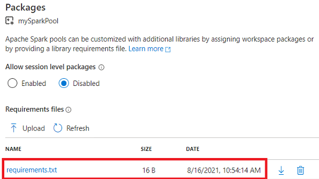
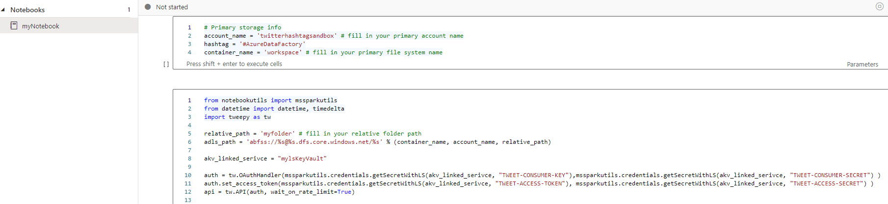
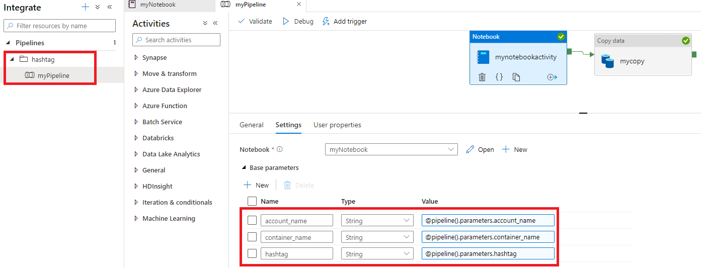
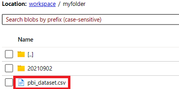
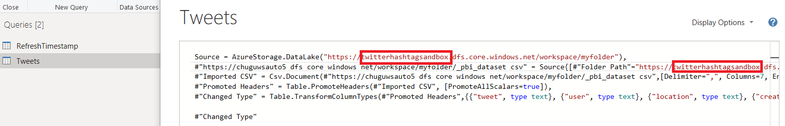
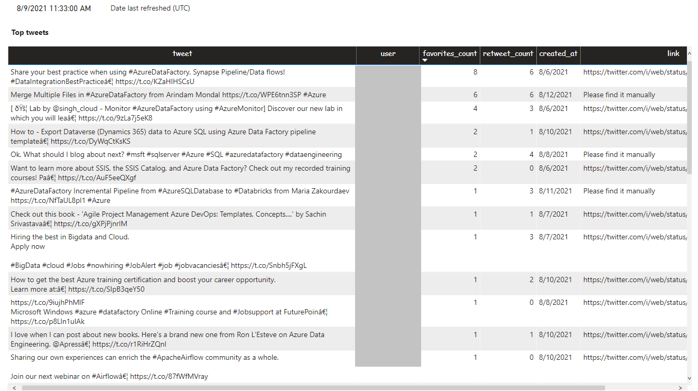

# Twitter data analytics with Synapse pipeline

## Scenarios

Using **Synapse pipeline** with **Synapse notebook activity**, extract and transform data for Twitter hashtag (e.g. #AzureDataFactory). Then Power BI dashboard directly loads transformed data landed in Azure Data Lake Storage.

This sandbox sets everything from scratch with few steps, then you can get Power BI dashboard with latest data landed in Azure Data Lake Storage. Detail list of artifacts included are:

- A Synapse workspace
- A Spark Pool with package setting applied
- A Python Notebook, which pulls tweets of a hashtag, transformed and landed to Azure Data Lake Storage
- [Synapse pipeline](https://docs.microsoft.com/azure/data-factory/concepts-pipelines-activities), which runs a [Synapse notebook activity](https://docs.microsoft.com/azure/synapse-analytics/synapse-notebook-activity?tabs=classical) with [parameters passing](https://docs.microsoft.com/azure/synapse-analytics/synapse-notebook-activity?tabs=classical#passing-parameters) to Notebook.
- Power BI dashboard directly loads data from Azure Data Lake Storage

## Prerequisite Checks

* You have [Twitter developer account](https://developer.twitter.com/en/apply-for-access). Secretes are stored in your Azure Key Vault corresponding secretes:
    - "TWEET-CONSUMER-KEY"
    - "TWEET-CONSUMER-SECRET"
    - "TWEET-ACCESS-TOKEN"
    - "TWEET-ACCESS-SECRET".

* PowerShell Environment Setup
   * Check [PowerShell 7.x](https://docs.microsoft.com/en-us/powershell/scripting/install/installing-powershell-core-on-windows?view=powershell-7.1) installation will be used in the migration tool.
   * Check the **Execution Policy** for PowerShell using Get-ExecutionPolicy -List
   * **Unblock-file** - Depending on the setup of your PowerShell environment, you will have to [Unblock-file](https://docs.microsoft.com/powershell/module/microsoft.powershell.utility/unblock-file?view=powershell-7.1)

* Install the following PowerShell Modules
   * _Az.Resources_ - Install-Module -Name Az.Resources -MinimumVersion 3.3.0 -AllowClobber -Force
   * _Az.Synapse_ - Install-Module -Name Az.Synapse -MinimumVersion 0.8.0 -AllowClobber -Force

## Steps

### Synapse workspace

1. If you already have a workspace, make sure **Synapse Contributor role** is assigned before the step to run **SetupSandbox.ps1**

    If you do not have Synapse workspace, [Deploy a Azure Synapse workspace](https://github.com/Azure-Samples/Synapse/tree/main/Manage/DeployWorkspace)

    - Synapse workspace is created.
    - Default Linked Service to primary storage is created.
    - RBAC to primary storage is not assigned.
    - No Spark Pool.

1. Assign Synapse workspace primary storage **Blob Storage Contributor Role** to workspace. (Note: it takes a while to get effective.)

1. Add AKV access policy: secrete **Get** permission to workspace.

1. Replace variables in **SetupSandbox.ps1**:

1. Run **SetupSandbox.ps1**. Below artifacts are created and configured:

    - Spark Pool (auto pause enabled) is created
        

    - Package setting is applied. (tweepy==3.10.0)
        

    - Notebook is imported.
        
        The notebook pulls tweets from twitter, process data, write data into Synapse primary storage.
        

    - Pipeline artifacts are created: a Key Vault linked service, a dataset and a pipeline with a Notebook activity.
        

1. Execute pipeline or schedule the pipeline run.

   **pbi_dataset.csv** under "primary_storage_workspace/primary_file_system_name/myfolder" is generated.

    

### Power BI dashboard

1. Assign **Blob Storage contributor** role to login user of Power BI.

1. Download **HashtagDashboard.pbix**, and replace with your Synapse primary storage URI.
    

1. Refresh and get all tweets tagged with the hashtag ranking with favorites or retweets.
    