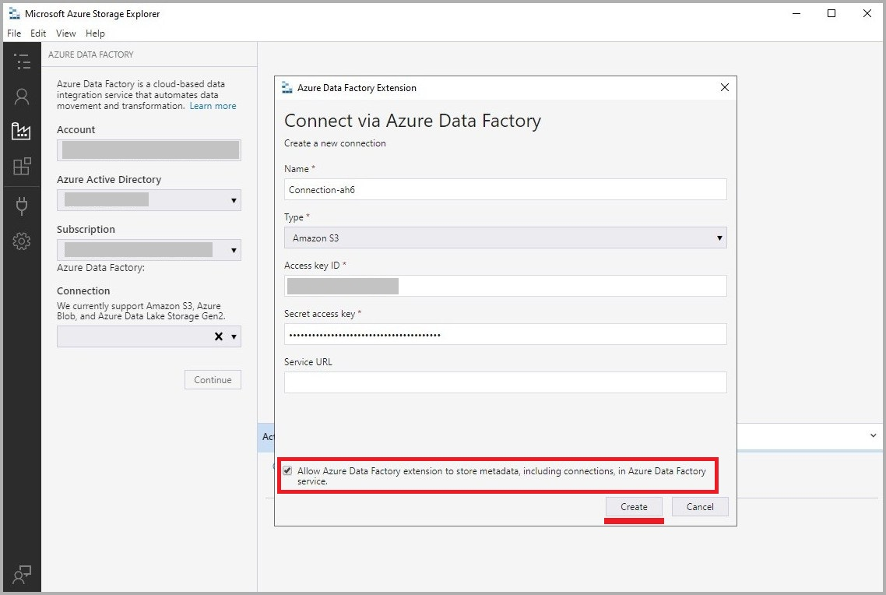
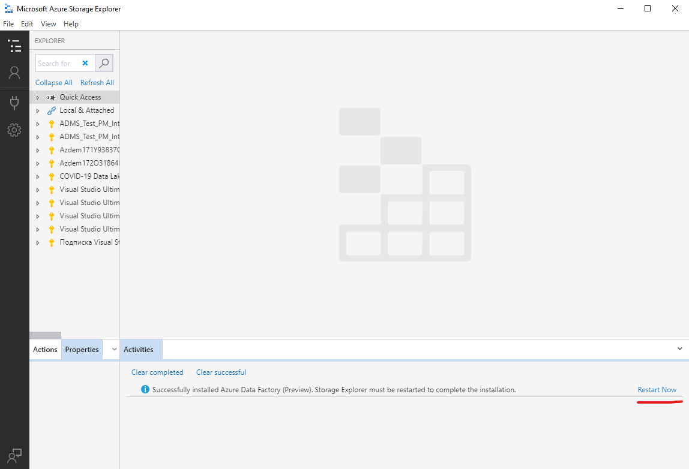
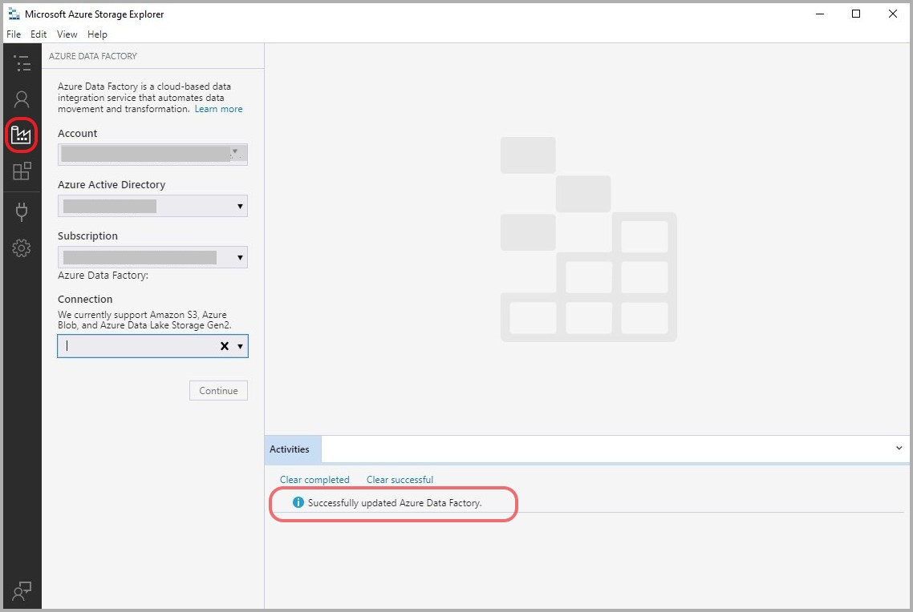
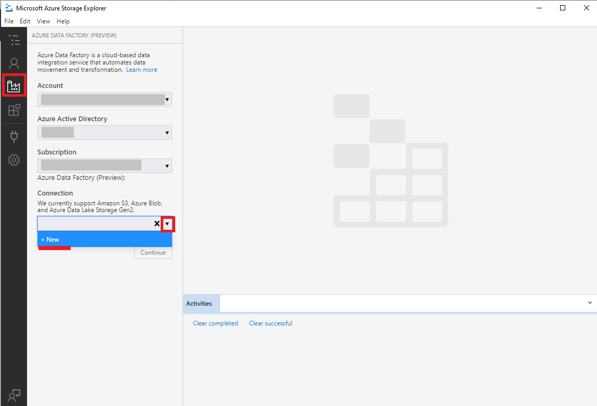
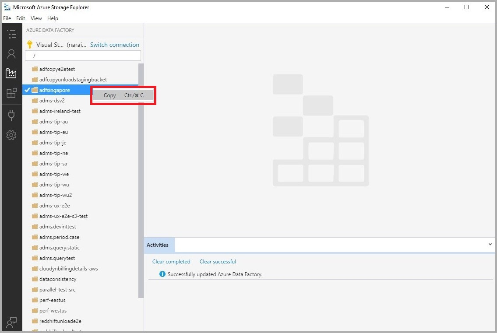
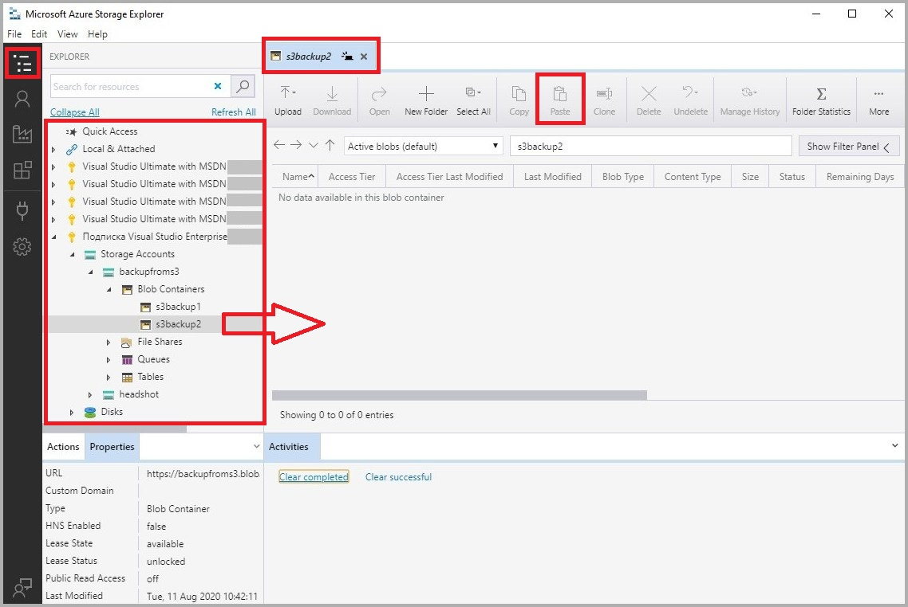
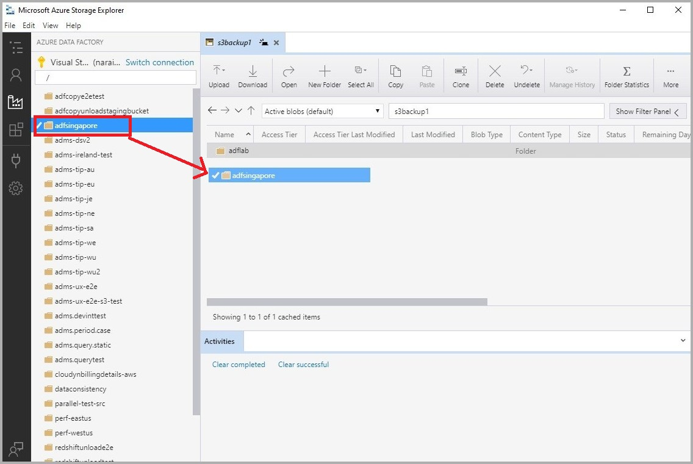
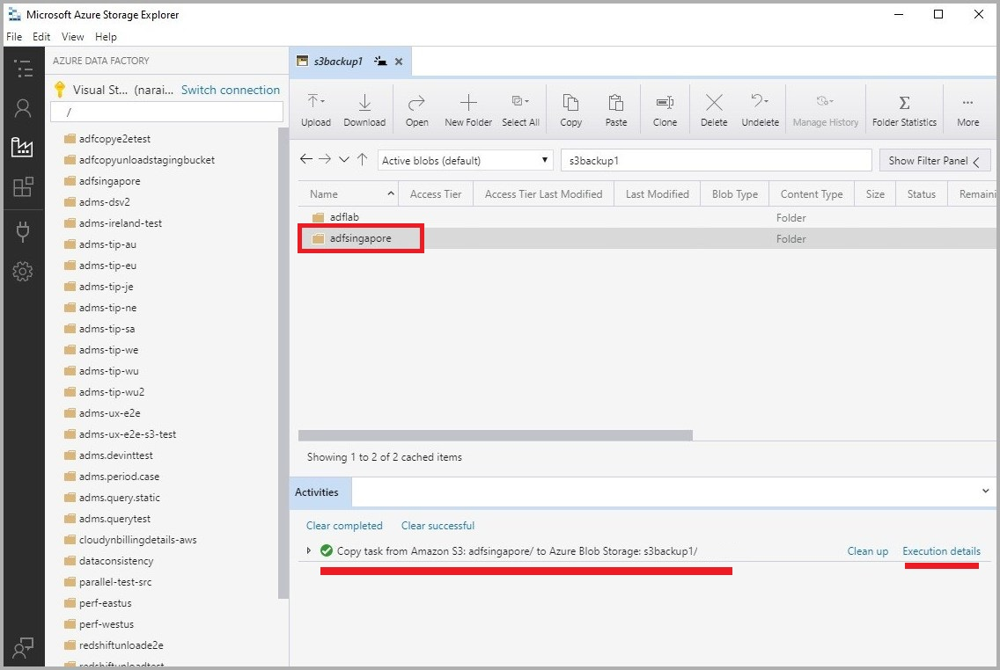
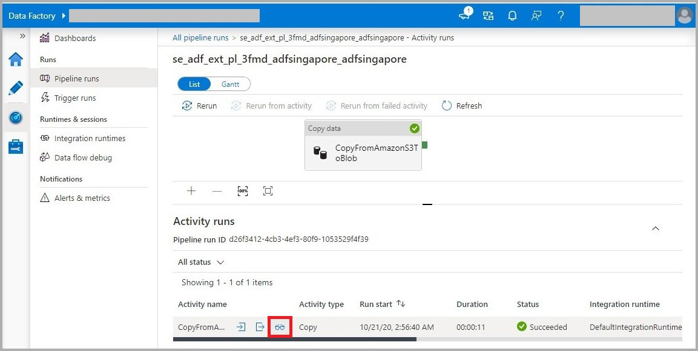

# Storage Explorer extension (Deprecated)

## Overview

Microsoft Azure Storage Explorer is a standalone app that makes it easy to work with Azure Storage data on Windows, macOS, and Linux. With the **Azure Data Factory extension for Storage Explorer**, you can now move data from **Amazon S3** or **Google Cloud Storage** to Azure Storage without having to author a data factory pipeline and with the same ease-of-use that you get with storage explorer for performing simple backup tasks/ copying data into Azure. 

> Note: The Storage Explorer extension provides basic binary copy functionalities with a simplified user-experience, suited for customer's moving data to storage from Amazon S3 or Google Cloud Storage (binary copy) in a Azure Storage like experience. For advanced scenarios (schema aware copy, transformation) we suggest using [Azure Data Factory UI](https://adf.azure.com).

In this article, you'll learn how to use the Azure Data Factory extension for moving data from Amazon S3 to Azure Storage (Blob, Gen2).

## Demo video

## Prerequisites

- You will require Storage Explorer ***November (Version 1.16.0)*** or later to be able to use the Azure Data Factory extension with it. To download and install the latest version of Storage Explorer, see [Azure Storage Explorer](https://www.storageexplorer.com/).

- You must have an Azure subscription. Learn how to [sign-in using Azure subscription](https://docs.microsoft.com/en-us/azure/vs-azure-tools-storage-manage-with-storage-explorer?tabs=windows#sign-in-to-azure ). 

  For more details on setting up Storage Explorer and it's prerequisite, see [Storage Explorer prerequisites](https://docs.microsoft.com/azure/vs-azure-tools-storage-manage-with-storage-explorer?tabs=windows#prerequisites).

---

## Download and install

- To download and install Azure Data Factory extension, navigate to [Azure Data Factory extension]. (As part of the deprecation, we removed the download link.)

- Run the downloaded extension (.seix) to install. The process will automatically open up the storage explorer (if not already open) with the ADF extension enabled. 

  

- After restarting Storage Explorer, you would now see the Azure Data Factory extension installed and can navigate to it by clicking on the Data Factory icon in the menu.

  

---

## Connecting to a Amazon S3 storage

1. Navigate to the extension and create a new connection

   

2. Add Amazon S3 credentials to connect. 

   

3. Right-click and copy the desired folder/ file from the navigation bar that lists all Amazon S3 account data. 

   

4. Navigate to the destination storage account by clicking on toggle explorer and select the storage container. Open it up double-clicking it. Since you have copied the file/ folder in the previous step from Amazon s3, you can paste it in this storage account. 

   

5. Alternatively, you can even use a drag-and-drop gesture to copy the files/ folders from Amazon S3 to Azure Storage (blob/ Gen2). 

   

6. Monitor and validate the data movement/ copy.  

   

7. You can find more details around the copy job and find more advanced information by viewing the job information in Azure Data Factory UI. You can navigate there by simply clicking on 'Execution details' under Activities in Storage Explorer.  

   

## FAQ and troubleshooting

1. What Azure subscription role assignments are needed for the functionality of the plugin?

   - *You should have an Azure subscription to use the plugin.* 
   - *You need to be subscription contributor. If you do not have contributor access on subscription, then at least ensure that there is a resource group under the subscription with the name as the 'subscription id', and you should have contributor permissions on this resource group to make the ADF plugin work.* 

2. How does the storage explorer work? Does it create a Data Factory instance?

   - *The Storage explorer plugin creates a new data factory instance behind the scenes (during the 1st time usage and reuses the same factory there after). When you drag-and-drop or copy/paste files/ folders using the plugin, appropriate pipelines in the ADF service are generated and executed to power the data movement.*
   - *The data movement is powered by Cloud (ADF service) and does not consume your local machine's bandwidth.*   

3. How much does it cost for the data movement using the plugin? 

   - *Since we require ADF service to be created to power the data movement, there is equivalent charges that will apply to your data movement jobs. Please check Azure Data Factory pricing page for [more details](https://azure.microsoft.com/pricing/details/data-factory/).* 
   - *Under Activities in storage explorer, we should the pipeline information and DIU consumption. You can use this value to estimate the data movement cost.* 

4. Who is the plugin for?

   - *For anyone requiring to move data (binary copy) from Amazon S3 or Google Cloud Storage to Azure storage. This does not require you to understand ADF concepts at all, through you can always find the created pipelines under the ADF instance by logging in the ADF UI (https://adf.azure.com).*  

     *E.g. Many interactive data science experiments may require bringing data from various sources (S3) to Azure storage before running the experiment.* 

   - *For advanced use cases, we suggest using ADF UI (https://adf.azure.com) since we expose many more advanced properties that can be used for various scenarios.* 
