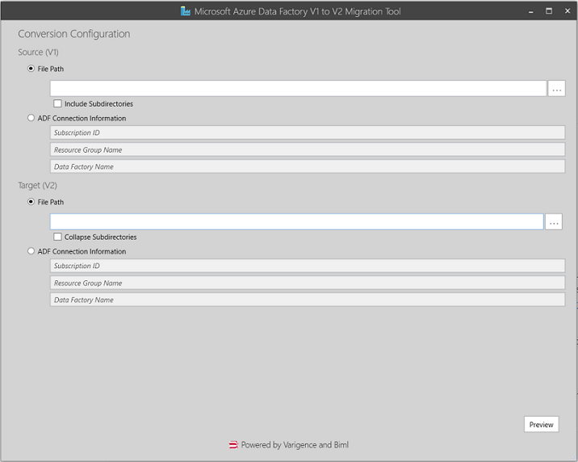
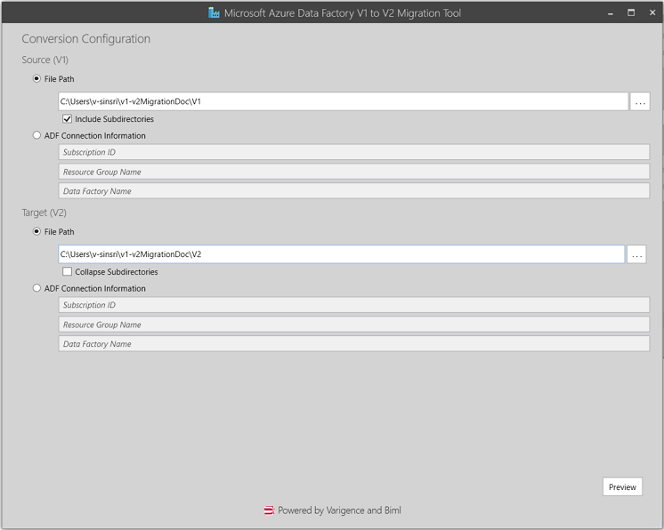
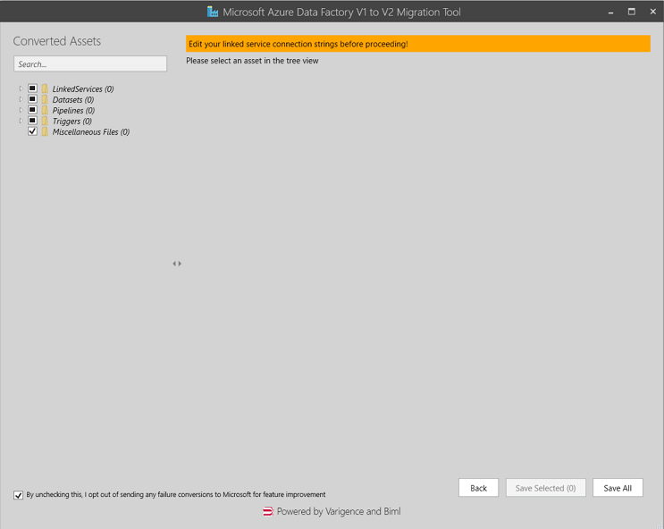
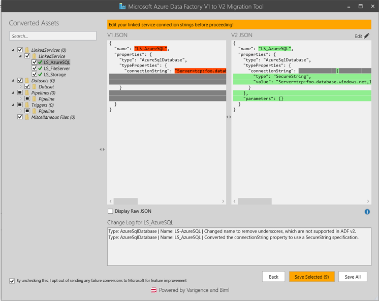
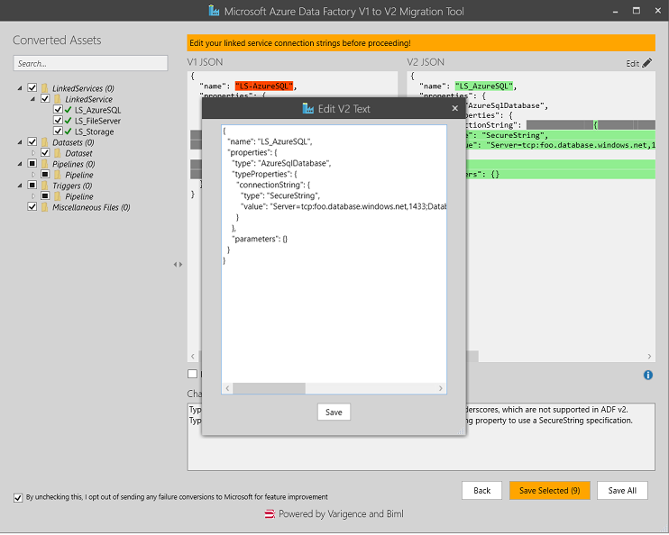
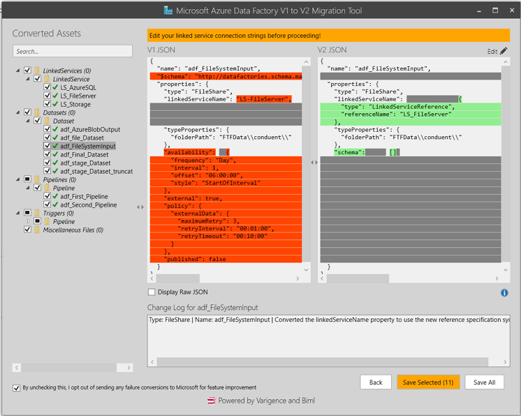
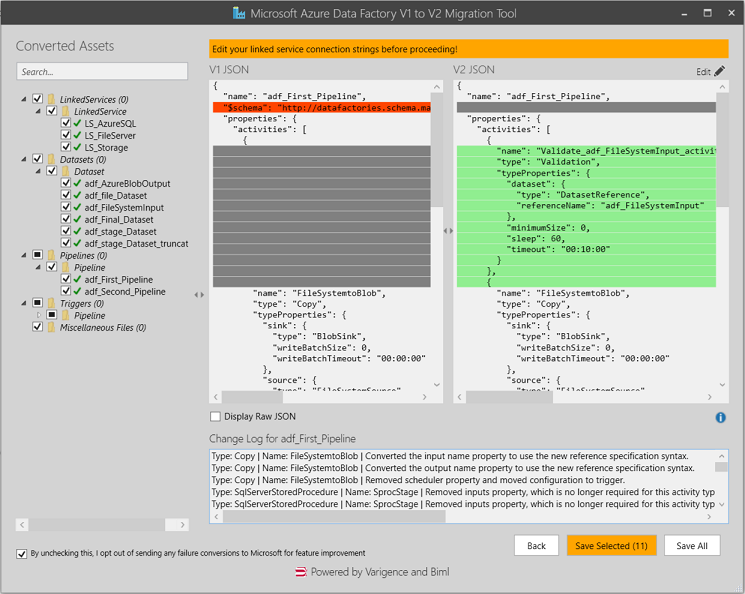
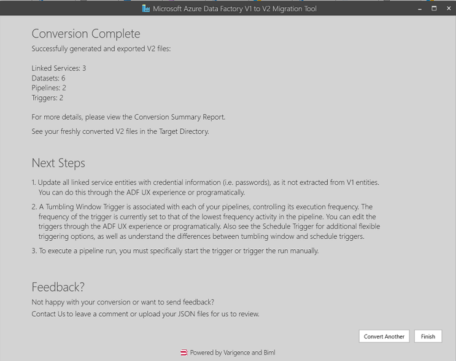

# Tutorial: Migrate your V1 Azure Data Factory to V2

- 08/26/2021
- 10 minutes to read

&nbsp; &nbsp;

**APPLIES TO:**  Azure Data Factory Version 1

This tutorial describes how to migrate your V1 Azure Data Factory to V2 Azure Data Factory using the migration tool. 
Please note that the tool is not a one-click solution and may require manual steps to complete the migration. This is the best effort from our end to support you with the migration. For any queries please reach out to us at [ADF V1 Customer Migration DL](mailto:adfcustomermigrate@microsoft.com)

There are 3 ways you can achieve this. 
This tutorial describes how to migrate your V1 Azure Data Factory to V2 Azure Data Factory using the migration tool. There are 3 ways you can achieve this. 

1. Offline conversion of V1 artifacts to V2 (Datasets, Linked Services and Pipelines)

2. Offline conversion of V1 JSON files and using PowerShell to upload the converted JSON files to ADF V2 instance

3. Using PowerShell to download V1 JSON files , convert and upload them to ADF V2 Instance


Note

This article does not provide a detailed introduction of the Data Factory service. For an introduction to the Azure Data Factory service, see [Introduction to Azure Data Factory](https://docs.microsoft.com/en-us/azure/data-factory/introduction)

For a tutorial on how to create Azure Data Factory using PowerShell, see : [Create Data Factory using PowerShell](https://docs.microsoft.com/en-us/azure/data-factory/quickstart-create-data-factory-powershell).

&nbsp;

## Prerequisites

- [New Azure PowerShell Az module](https://docs.microsoft.com/en-us/powershell/azure/install-az-ps?view=azps-5.0.0) installed in order to download and upload JSON files for online conversion

- [V1 to V2 Migration tool](./migrationtool/AdfUpgrader_20.2.63411.0.msi) downloaded and Installed


- Downloaded V1 assets- Datasets, Linked Services and Pipelines, if using Option 1. or Option 2. for conversion

- Access to ADF V2 Resource in Azure portal, if using Option 2.

- Access to both ADF V1 and V2 resources in Azure Portal, if using Option 3.

&nbsp;  
## 1. Offline Migration [Recommended]

If you have your V1 artifacts downloaded locally, you can do an offline conversion and upload the converted files to V2 instance using powershell. The advantage here is you can edit your connection strings and preview the changes before uploading them to V2 instance. Here are the steps for offline conversion:

1) Create a folder structure for your V1 artifacts as shown below:

```
        |-- Datasets
        	|--ds1.json
        	|--ds2.json
        	|--ds3.json
        	|--ds4.json
        	|--ds5.json
        	|--ds6.json
       
        |-- LinkedServices
        	|-- ls1.json
        	|-- ls2.json
        	|-- ls3.json
        
        |-- Pipelines
            |-- pl1.json
            |-- pl2.json
           
```


2) Create another folder (say V2) for the tool to generate V2 artifacts.

3) Run the migration tool msi and you will see a screen as shown below:



&nbsp;

4) Point Source File Path to the folder that contains your V1 artifacts and Select the checkbox to Include Subdirectories.

​Also set the Target(V2) Path to the folder where you want V2 JSON files generated. 



&nbsp;

5) Click on Preview. This gives you a warning to edit your Linked Services by selecting them from the left hand side tree view.


 
&nbsp;

6) You can now select each Linked Service, dataset or pipeline and preview the changes . When you click on any Linked service checkbox, it opens a side by side view of existing V1 and converted V2 parameters. The differences are highlighted with different colors. Gray color indicates what has been removed. 

There is a change Log box at the bottom of the screen to provide more details on what has been changed and why.





7) You can click on edit icon on the top right hand corner to make any changes to the connection String or JSON parameters and Save the changes.




​8) **Dataset preview Sample**




9)	 **Pipeline preview sample**




​10)	Once the changes are all done, you can either click Save Selected or Save All option to Save your changes. This would take you to the Conversion complete screen as shown below:




You can view the conversion summary report by either clicking on the Conversion Summary Report hyperlink in the screen shown above or find it generated in the V2 assets folder. You can reach your V2 target folder by clicking the Target Directory hyperlink in the Conversion complete screen.
  &nbsp;   

11) The next step would be to upload your V2 assets to Data Factory using PowerShell and view them on [Azure portal](https://portal.azure.com/)

12) For any feedback or queries please reach out to us at [ADF V1 Customer Migration DL](mailto:adfcustomermigrate@microsoft.com).


