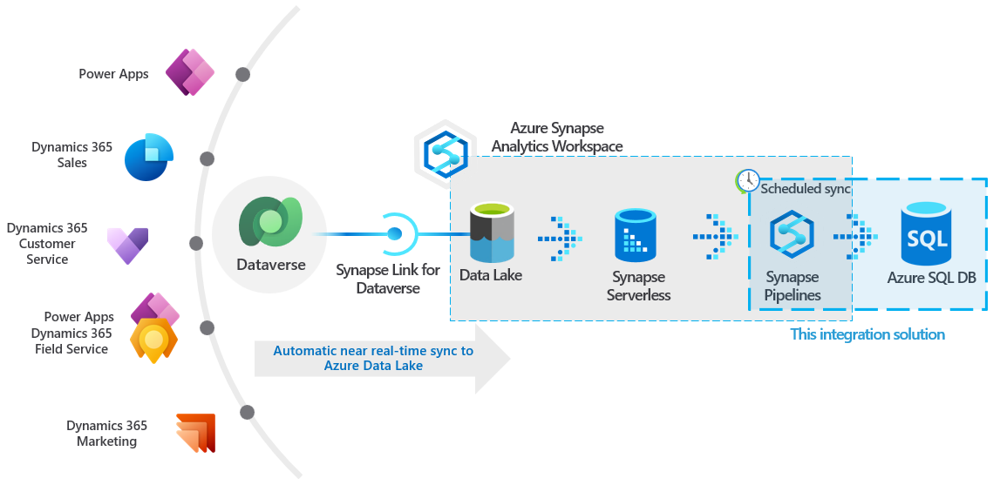
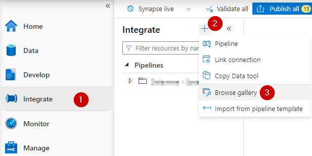
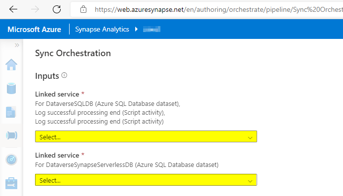
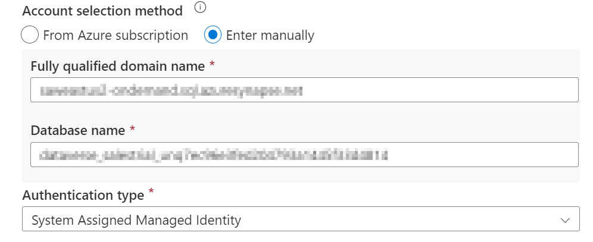
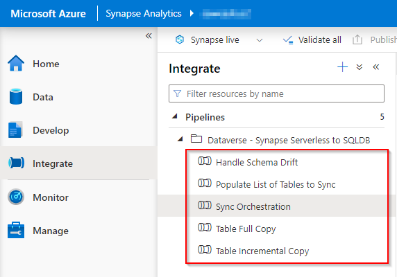
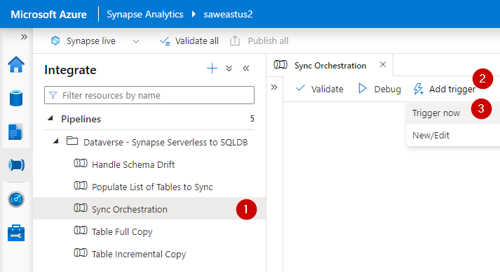
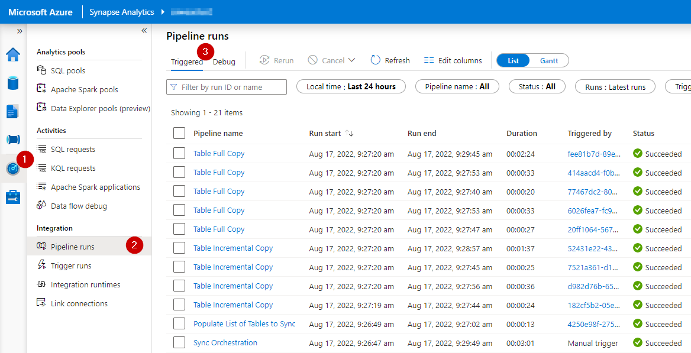

# Sync Dataverse data from Synapse Serverless to Azure SQL DB
 Extend Azure Synapse Link for Dataverse by syncing Dataverse data to an Azure SQL DB.

## Background and Problem Statement
[Microsoft Dataverse](https://docs.microsoft.com/en-us/power-apps/maker/data-platform/data-platform-intro) is a secure and versatile data storage and management layer for a variety of business applications, such as Microsoft Dynamics, Power Apps, Power Automate, etc. [Synapse Link for Dataverse](https://docs.microsoft.com/en-us/power-apps/maker/data-platform/export-to-data-lake) provides a seamless  mechanism for continuously exporting Dataverse data to your Synapse Analytics Workspace for integration, analytics and business intelligence purposes.

While data exported via Synapse Link for Dataverse can be accessed using Synapse Analytics Serverless SQL Pools, some customers may prefer to make Dataverse data available in an Azure SQL Database to support a broader range of data integration or data enrichment requirements. This scenario may be particularly relevant for customers who previously used the [Data Export Service (DES)](https://docs.microsoft.com/en-us/power-apps/developer/data-platform/data-export-service) to bring Dataverse data from their Microsoft Dynamics applications to their Azure SQL Database. 

The Data Export Service was deprecated in November 2021 and will reach its [end-of-support and end-of-life in November 2022](https://powerapps.microsoft.com/en-us/blog/do-more-with-data-from-data-export-service-to-azure-synapse-link-for-dataverse/). Synapse Link for Dataverse does not natively support an Azure SQL DB as the destination for data export. However, a flexible and scalable data integration solution can be implemented to copy Dataverse data from a Synapse Analytics Workspace an Azure SQL database as a replacement for the Data Export Service.

## Solution Overview
This repository includes a solution accelerator for incrementally synchronizing Dataverse data from external tables in Synapse Serverless SQL Pool to an Azure SQL Database. The solution consists of Synapse Pipelines for data movement, as well as database objects for configuration and logging of the data integration process. This solution can be rapidly deployed to dynamically synchronize any number of tables between a Serverless SQL Pool and an Azure SQL DB.

The architecture of this solution is depicted on the following diagram:



This solution supports copying tables either incrementally or in full. Most tables will be loaded incrementally. However, certain metadata tables, such as StateMetadata, StatusMetadata, OptionsetMetadata, GlobalOptionsetMetadata and TargetMetadata should be loaded in full (since they tend to be small and do not have relevant columns to indicate when specific records have been modified).

The solution keeps track of integration pipeline runs for each table and retrieves only those records that have been added, changed or soft-deleted since the latest successful pipeline run.

In order to facilitate incremental copying of data, this solution requires table export in Synapse Link for Dataverse to be configured in *append-only mode* as described in the following [article](https://docs.microsoft.com/en-us/power-apps/maker/data-platform/azure-synapse-link-advanced-configuration#in-place-updates-vs-append-only-writes). Hence, data available in the Serverless SQL Pool may contain multiple versions of any given record, as that record evolves over time. However, this solution deduplicates the data in such a way that the destination Azure SQL Database contains only the latest version of any given record, which simplifies the consumption of the data.

Deleted records in incrementally copied tables are handled as soft deletes by adding a flag to the IsDelete column. If desired, database views can be added in the target SQL database to filter out the deleted records.

For scenarios requiring lower latencies (such as near-real-time access to data), the solution can be configured not to use the "_partitioned" tables based on hourly snapshots, but rather regular tables that are receiving data from Synapse Link on an ongoing basis.

This solution automatically handles common types of schema evolution in the source system. Synapse Link for Dataverse will automatically accommodate newly added columns (as documented [here](https://docs.microsoft.com/en-us/power-apps/maker/data-platform/export-data-lake-faq)). This solution will detect newly-added columns during each pipeline execution and will add corresonding columns to the tables in the target database. Columns deleted from the source system will remain in the target database, but will no longer be updated.

This solution will automatically create several helper objects in the target Azure SQL Database during the first synchronization. These objects will support configuration and logging of the data integration process. Following is the list of helper database objects:

- Schemas: orchestration and staging
- Tables: orchestration.ProcessingControl and orchestration.ProcessingLog
- Stored Procedures: orchestration.GetTablesToProcess, orchestration.GeneratePrimaryKey and orchestration.SchemaDriftHandler.

## Implementation
### Prerequisites
1. You have [provisioned a Synapse Analytics Workspace](https://docs.microsoft.com/en-us/azure/synapse-analytics/quickstart-create-workspace).
1. You have [configured Synapse Link for Dataverse to export relevant entities to a Synapse Analytics Workspace](https://docs.microsoft.com/en-us/power-apps/maker/data-platform/azure-synapse-link-synapse). This solution requires table export to be configured in *append-only mode* as described in the following [article](https://docs.microsoft.com/en-us/power-apps/maker/data-platform/azure-synapse-link-advanced-configuration#in-place-updates-vs-append-only-writes).
1. You have sufficient read access to the lake database created by Synapse Link for Dataverse and to the underlying Data Lake storage account.
1. You have admninistrative access to the Synapse Analytics Workspace 
1. You have administrative access to the target Azure SQL DB.

### Installation
1. Provision an Azure SQL Database to serve as the target of your Dataverse data. [See documentation](https://docs.microsoft.com/en-us/azure/azure-sql/database/single-database-create-quickstart?view=azuresql&tabs=azure-portal). Ensure that the "Allow Azure services and resources to access this server" setting is enabled. [See documentation](https://docs.microsoft.com/en-us/azure/azure-sql/database/firewall-configure?view=azuresql)

2. Grant your Synapse Analytics Workspace access to your target Azure SQL Database by adding the managed identity of your Synapse Analytics Workspace to the db_owner role in the Azure SQL Database. [See additional documentation](https://docs.microsoft.com/en-us/azure/data-factory/connector-azure-sql-database?tabs=data-factory#managed-identity). You may use the following SQL statement: 

```SQL
CREATE USER [YourSynapseAnalyticsWorkspaceName] FROM EXTERNAL PROVIDER
GO
ALTER ROLE [db_owner] ADD MEMBER [YourSynapseAnalyticsWorkspaceName]
GO
```
3. Ensure that the managed identity of your Synapse Analytics Workspace has access to the storage account container where your Dataverse data is stored by adding it to the *Storage Blob Data Reader* role. [See additional documentation](https://docs.microsoft.com/en-us/azure/synapse-analytics/security/how-to-grant-workspace-managed-identity-permissions). 

4. "Browse gallery" to find the pipeline template corresponding to this solution. Then, import the template from the gallery: 



5. During the template import process, configure linked services for target Azure SQL DB and the source Serverless SQL Pool endpoint (as illustrated below). 



6. Note: while configuring linked services for the source and target databases, please manually specify the fully-qualified domain name of your SQL endpoint and database name as illustrated below:



7. Once the import process completes, you will find five pipelines in the *Dataverse - Synapse Serverless to SQLDB* folder, as illustrated below:



8. Clikc on the *Publish All* button in the header of your Synapse Analytics Workspace to publish the pipelines and related artifacts to your Synapse Workspace.

### Configure and test your pipeline
**Sync Orchestration** is the main pipeline responsible for orchestrating the data synchronization process. To test the data synchronization process, use the *Trigger now* feature for the *Sync Orchestration* pipeline, as illustrated below.



While triggering the execution of the pipeline, you will be prompted to configure several parameters that allow you to customize its behavior to meet your needs.

> - AutoPopulateListOfTablesToSync 
> - AutoGeneratePrimaryKeys
> - TableGroupToSync
> - UsePartitionedTables
> - DefaultTargetSchema

1. **AutoPopulateListOfTablesToSync** (default: true): by default, the solution is designed to perform automatic discovery of tables available in the source Serverless SQL database. Any table that appears to contains Dataverse data, as well as certain metadata tables (StateMetadata, StatusMetadata, OptionsetMetadata, GlobalOptionsetMetadata and TargetMetadata) will be automatically added to the *orchestration.ProcessingControl* table. If you prefer to disable auto-discovery (perhaps, after initially populating the list of desired tables), please set the *AutoPopulateListOfTablesToSync* parameter in the *Sync Orchestration* pipeline to *false*. Note, to maximize efficiency, it is recommended to disable automatic discovery of tables when configuring triggers that will be executed with high frequency (for near-real-time data access scenarios).

1. **AutoGeneratePrimaryKeys** (default: true): by default, the solution will automatically add a clustered primary key index to each target table that does not have a primary key already. These primary keys will improve the efficiency of the incremental sync process. If you prefer to manage primary key creation manually, you may disable automatic primary key generation by setting the *AutoGeneratePrimaryKeys* parameter in the *Sync Orchestration* pipeline to *false*.

1. **TableGroupToSync** (default: 1): by default, *all* source tables will be synced to the target database whenever the *Sync Orchestration* pipeline is executed. Yet, this may not be desirable if data latency requirements differ significantly across tables. When low latency of data is expected for some tables, these tables can be addded to a designated Table Group and their synchornization can be triggered on a frequent schedule. Other tables can be added to a different Table Group and their synchornization can be trigger on a less frequent schedule.

    1. All newly discovered table will be added to Table Group 1, when they are added to the *orchestration.ProcessingControl* table. 
    1. If desired, you may update records in the *orchestration.ProcessingControl* table to reassign specific tables to a separate Table Group (such as TableGroup 2, 3, etc.)
    1. When triggering the execution of the *Sync Orchestration* pipeline, specify which TableGroup should be synchornized by setting the value of the *TableGroupToSync* parameter.

1. **UsePartitionedTables** (default: true): by default, this solution is configured to use external tables  in the Serverless SQL Pool database that leverage [read-only hourly snapshots](https://docs.microsoft.com/en-us/power-apps/maker/data-platform/azure-synapse-link-synapse#access-near-real-time-data-and-read-only-snapshot-data-preview).

    1. Using read-only snapshots helps to avoid read/write contention issues while reading data from files that are being written to by Synapse Link for Dataverse. Tables based on snapshot data in Serverless SQL Pool databases are labeled with the "_partitioned" suffix. Note, at the time of this writing, Synapse Link for Dataverse would not create snapshot data for empty tables. 

    1. For scenarios requiring lower latencies (such as near-real-time access to data), the solution can be configured not to use the "_partitioned" tables based on hourly snapshots, but rather regular tables that are receiving data from Synapse Link on an ongoing basis. You may do so, but setting the UsePartitionedTables parameter to *false*. To support this configuration, your Synapse Link for Dataverse must satisfy the following requirements:
    
        1. Synapse Link for Dataverse must have been configured after August 2022. External Tables created by Synapse Link for Dataverse after August 2022 are configured with the [ALLOW_INCONSISTENT_READS](https://learn.microsoft.com/en-us/azure/synapse-analytics/sql/create-use-external-tables#external-table-on-appendable-files) table option, which allows for Serverless SQL Pools to read the data files while new records are being written to these files.
        1. Synapse Link for Dataverse must have been configured to export data in CSV format. At the time of this writing, Synapse Link for Dataverse implementations that export data in the Delta Lake format lack the soft-delete functionality that this synchronization solution requires.

5. **DefaultTargetSchema** (default: dbo): by default, the solution will create destination tables in the *dbo* schema of the target database. If you prefer to create destination tables in a different schema, change the *DefaultTargetSchema* parameter to meet your requirements.

> The *DefaultTargetSchema* you specify must exist in the target database. If necessary, create the desired schema.

### Monitor synchronization process
After triggering the pipeline, you may monitor pipeline execution in the Synapse Analytics Workspace, as illustrated below.


In addition, you may monitor the outcomes of the synchronization process by querying the *orchestration.ProcessingLog* table in the target database.

Finally, you may examine the content of tables in the target database and identify individual rows that have been added/updated at a specific time by looking at the *SyncedToSqlDbOn* field that is added to each table by this solution.

### Configure recurring triggers
Create a scheduled trigger to execute the *Sync Orchestration* pipeline in an automated manner on a desired schedule. As discussed in the previous section, you may create multiple triggers, using different *TableGroupToSync* parameter values to optimize the synchronization of groups of tables with different data latency requirements.

Note, when *UsePartitionedTables* parameter is set to true, pipeline execution should be scheduled no more frequently than once per hour (since underlying snapshots will be created on an hourly basis).
> **IMPORTANT!** Please ensure that the time interval between pipeline triggers is sufficiently long (compared to the duration of each pipeline execution) to prevent the possibility of multiple pipeline executions attempting to update the same group of tables at the same time. Simultaneous execution of the synchronization pipeline for the same group of tables may apply updates to certain records ouf of order, which could lead to data consistency problems! 

>When attempting to execute the synchronization pipeline frequently (for near-real-time data access), consider using the [Tumbling Window trigger](https://learn.microsoft.com/en-us/azure/data-factory/how-to-create-tumbling-window-trigger?tabs=synapse-analytics%2Cazure-powershell) (rather than Scheduled trigger) and set the [maxConcurrency property of the trigger to 1](https://learn.microsoft.com/en-us/azure/data-factory/how-to-create-tumbling-window-trigger?tabs=synapse-analytics%2Cazure-powershell#:~:text=No-,maxConcurrency,-The%20number%20of) (which will ensure that new trigger runs will be added to a queue but will not run in parallel). Note that you can have only one Tumbling Window trigger per pipeline--it is advisable to use it for the table group that requires most frequent synchronization, while using Scheduled triggers with other table groups.


## Next Steps and Additional Considerations
* By default, all discovered tables will included in the synchronization process. If you woudl like to exclude specific tables from synchronization, you may update records in the *orchestration.ProcessingControl* table and set the *IsEnabled* flag to 0 for any tabel that you do not wish to synchronize.

* Consider creating non-clustered indexes to support specific query workloads that you anticipate.

* Consider creating views on top of tables in the target SQL Database to hide deleted records to simplify data access from client applications.

* Review performance and utilization of your target Azure SQL Database and adjust scale appropriately.

* If necessary, adjust and refine Synapse Pipeline settings that control the performance of the data synchronization proces, such as:
    * [Performance of Copy Activities](https://learn.microsoft.com/en-us/azure/data-factory/copy-activity-performance)
    * Batch count of ["For Each" activity](https://learn.microsoft.com/en-us/azure/data-factory/control-flow-for-each-activity)

* If the *AutoPopulateListOfTablesToSync* parameter in the *Sync Orchestration* pipeline is set to *true*, any new tables added to your Synapse Link for Dataverse will be automatically added to the ProcessingControl list and will be assigned to TableGroup 1. If you wish to disable the *AutoPopulateListOfTablesToSync* parameter, you may manually add new tables to be synchronized by this solution at any time. Simply add the configuration details for the desired tables to the `orchestration.ProcessingControl` table. The solution will automatically create a table in the destination datablase and will perform a full load of the table during the next scheduled pipeline execution. Incremental synchornizations will continue in the future.

* As previously discussed, common schema evolution scenarios (i.e., columns being added or deleted) are handled automatically. However, other potential scenarios, such as data type changes will need to be handled manually. Consider the following approaches:
    * Manually alter the definition of the table in the target SQL Database (recommended)
    * Drop the table in the target SQL Database and delete all records in the orchestration.ProcessingLog table related to the affected table. The table will be re-added and fully loaded with data during the next scheduled synchronization.

* This solution accelerator is designed to synchronize all columns from tables enabled for synchronization. In some scenarios, you may prefer to sync only a subset of columns from a given table (which may also improve the efficiency of the synchronization process). To accomplish that you may: 
    1.	Create a new Serverless SQL Database (within the same Synapse Analytics Workspace as the Lake Database created by Synapse Link for Dataverse).
    2.	Create a set of cross-database views pointed to the tables in the Lake Database managed by Synapse Link for Dataverse. 
    3.	As part of view definitions, include the columns that you are interested in and omit the ones that are not relevant. Note, the following columns are required for incrementally-updated tables: *Id, IsDeleted, SinkModifiedOn and versionnumber*.
    4.	The Linked Service in the Synapse Pipeline created by the solution accelerator will need to be pointed to the Serverless SQL Database that you have created (rather than the Lake Database created by Synapse Link for Dataverse).

* If desired, consider hardening security settings of the implemented solution, which may include:
    * Applying more restrictive firewall rules to the Azure SQL Server hosting your target database
    * Granting more restrictive database permissions to the managed identity of your Synapse Analytics Workspace (as compared to the db_owner role suggested above)


## Acknowledgements
* Author: [Slava Trofimov](https://github.com/slavatrofimov)
* Special thanks to [Scott Sewell](https://github.com/mscottsewell) for solution testing and validation.